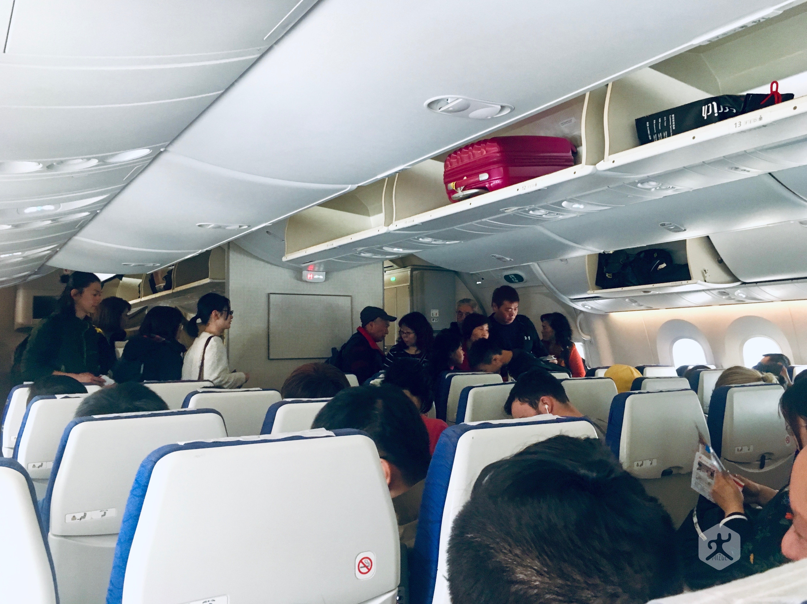
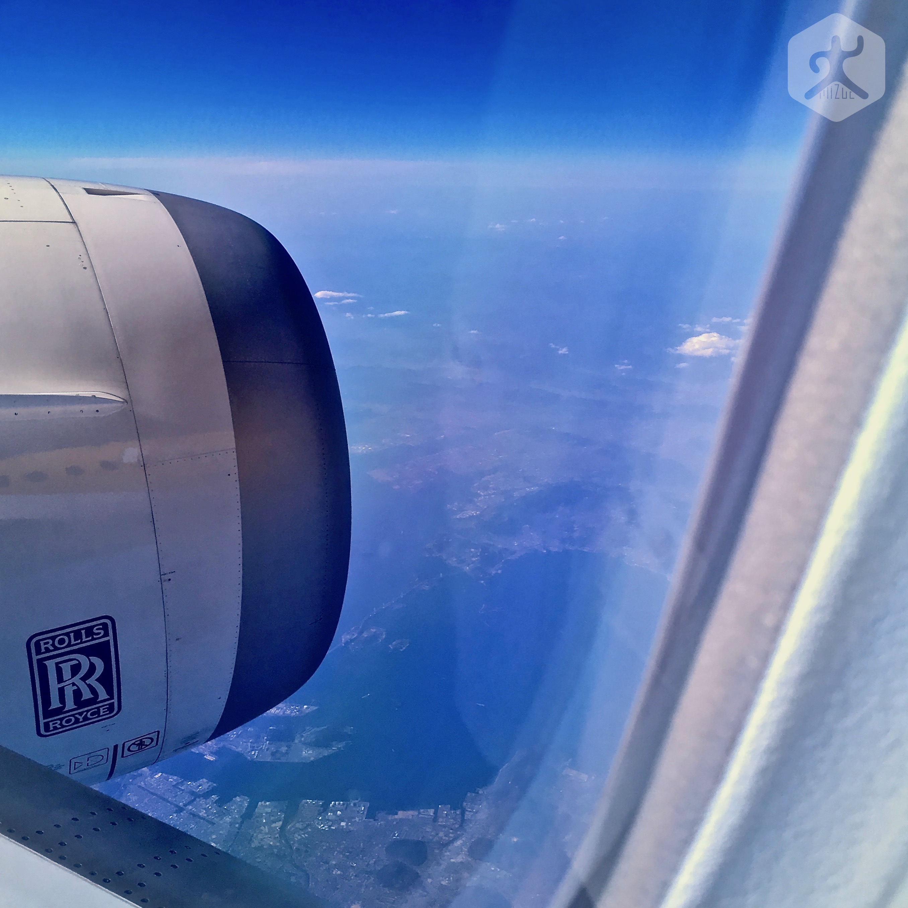

原本早在半年前就買好了3月20日，前往日本大阪的搭乘樂桃航空（Peach Aviation）廉航機票，卻因為事情耽擱只能臨時取消後（真的臨時，19日晚上才取消），又立刻在酷航航空（Scoot Air）買了26日前往北海道札幌的新千歲機場的廉航機票（假新書名：再忙也要去旅行），這似乎是我第一次搭乘 Scoot 酷航。

Scoot 酷航飛日本北海道（Hokkaido Japan）起飛時間挺對我胃口，**早上十一點半起飛**，表示我可以睡到曬屁股了再悠哉轉搭各種大眾運輸交通工具前往桃園機場 —— 事後證明只是想太多，機場櫃檯已經在準備關櫃了才匆忙趕到。桃園機捷跟炸彈一樣，搭錯慢車真的慢到爆。

## 在桃園機場第一航廈搭乘酷航

酷航 Scoot 的櫃檯是位於**桃園機場第一航廈**（TaoYuan Airport Terminal 1），而且跟一般低成本航空不太一樣，酷航的櫃檯位於最後幾排的位置。

所以當關櫃時間只剩下不到三分鐘，我還在前三排櫃檯繞來繞去找不到黃色看板時，當下想說直接改行程去臺灣環島的心思都有了。

幸好最後還是能在滿頭大汗中，幸運抵達酷航在桃園機場租用的登機閘門，我甚至連慣例的電子機票都忘了拍照片，因為地勤已經開始準備讓旅客排隊進入機艙的作業（這樣就知道有多趕了）。

酷航的登機閘門也跟其他幾家低成本航空不太一樣，例如台灣虎航（Tiger Taiwan）跟樂桃航空（Peach Aviation）通常位於一航廈最偏僻的一號閘口（Gate 1），這次酷航租用的是離通道比較近的 5 號閘口，倒是讓我少跑一大段距離。

> ⚠️ 航班登機閘門需以電子機票上所列閘口號碼為準，甚至隨時注意機場電子看板以及現場地勤說明，因為臨時更換閘口的情況也可能偶而出現。
> 
> 迷走客安小提示

或許是這幾年經常搭飛機跑國外旅行的關係，很多早期還是空中新鮮人時兢兢業業的必要手續都會自我簡化。例如這次在通過閘門地勤查驗後，我立刻就把護照跟機票早早收進了口袋，避免在機艙內的狹窄空間中有多餘的動作。

結果一進機艙，帶有東南亞面貌風味的空姐立刻請我出示機票，就算說明了自己的座位號碼跟方位，她還是堅持需要出示查驗。

## 酷航 B787 機艙

酷航目前號稱是全787機隊，不是中華民國臺灣省島上常見廉航用的空中巴士（Airbus）或之前常出事的 ATR，而是他們的競爭對手波音公司（Boeing）的 B787系列（發動機是很名牌的 rolls royce 勞斯萊斯），這系列飛機的載客量比空中巴士 A320 多了將近一倍，座位數在 320~375 之間，A320 約 180 左右。這也是我第一眼看見酷航機艙時的感覺：「擠」。

酷航 B787 航班的機艙座位

經濟艙一共有三排座位區，每排又各有三張座椅，等於一行座位就足足比起 A320 多了1.5倍的椅子，相當然爾搭乘酷航航班的空間體驗自然比不上台灣虎航或樂桃航空了。

也或許是因為這個原因，空姐強制查驗機票的 SOP 也是為了避免有迷糊乘客跑錯走道造成後續困擾。

搭乘酷航飛機的整體感覺來說，相較於台灣虎航和樂桃航空，基本上不算太壞，但也不談不上太好。除了機艙內的乘客數量明顯較多以外，其實就跟普通廉價航空差不多。

真要說讓我印象最深刻的感想，還是坐在我後面那一排的兩個臺灣女生。

嘿，可別誤會有什麼豔遇，而是我座位正後方的那個幾乎是整路都在咳嗽、擤鼻涕。重點是我不曉得為何在臺灣省島上，經常會遇到這類型的組合，感冒的人不戴口罩，反而是沒感冒的朋友戴口罩（無語問蒼天）。

飛過日本四國高空的 Scoot 酷航航班

由於 Scoot 酷航是新加坡籍的廉航，空服員基本都不說中文（至少我那排的是這樣）；幸好短程航班倒不用擔心語言障礙，而且不像樂桃或虎航一樣會有積極銷售機上商品的行為出現，也算是另一種寧靜。

## 飛往日本北海道的新千歲機場

飛機是在臺北時間11:30前從臺灣省桃園國際機場（原中正機場）起飛前往日本北海道的新千歲機場（CTS, Sapporo of Hokkaido），航程時間約三個半小時，原預定著陸時間為東京時間 16:05，實際抵達時間約在當地時間 15:55 左右。

這應該是我搭乘低成本航空最長時間的一次（上次只到 Hakodate 函館）。

雖然聽說過 B787 的座位又寬敞、舒適，還是跟德國賽車椅製作公司合作生產，不過或許不是每架都這樣吧。因為我坐到後面就開始像隻猴子般扭來扭去調整屁股姿勢，而且我發現其他乘客上廁所的次數，也是目前在短航班中看過最頻繁的，至於是否和座椅舒適程度有關就不得而知了。

另外搭乘 B787 倒是發現一個有趣的新玩具（好啦，其實這玩意從8年前就開始商用了），機艙窗戶沒有遮陽板，反而多了一組控制鈕。這是一種液晶遮陽板，只要操作按鈕就能控制變色程度，甚至可以完全遮蔽光線。

酷航 787 航班的可調光窗戶

更棒的是只要開啟後，似乎還具有類似偏光濾鏡的效果，可以一邊觀賞外面風景，也不用在擔心會有強光滲透進來，就算全程打開窗戶欣賞悠悠白雲，也不用怕被隔壁鄰居白眼了。

官方網站：「[Scoot 酷航](https://www.flyscoot.com/zhtw)」