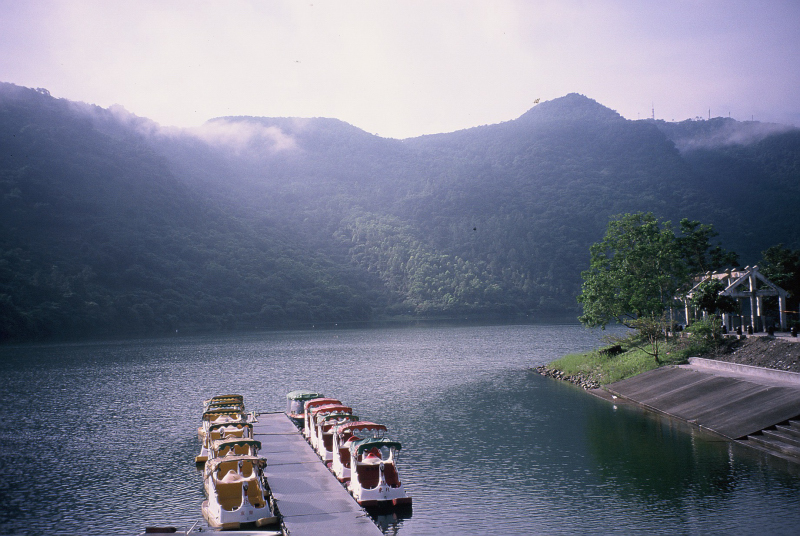
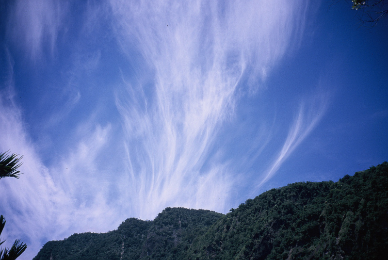
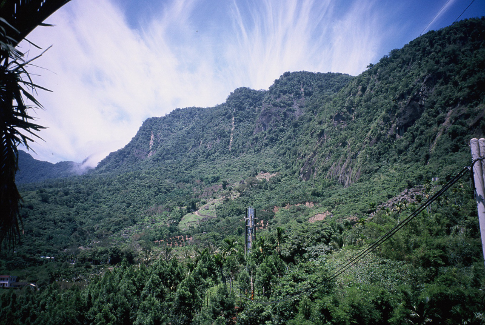
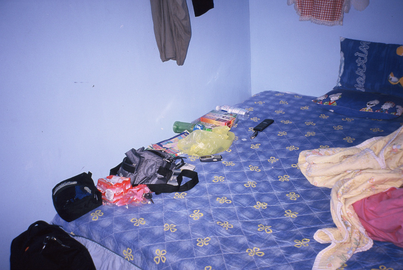

臺灣環島旅行，炎炎夏日，閒閒沒事，暑假消暑第一選擇。一個笨蛋，一個人跑去開車旅行，錢還沒帶夠，差點在屏東加霸王油。這是一場自由的夏天旅行。

## 花蓮七星潭的早晨

在花蓮七星潭一早醒來，發現距離昨天車宿位置一百公尺左右，一個偌大的軍營聳立在背後。迷走真心沒想到，這個軍營在夜晚的保密性做到十足，昨兒個夜宿時完全沒發現到。

醒來稍微振作精神，跑去岩灘上等著第一道光從大海最遙遠那道線伸展出來。昨天就寢前，迷走還在想像七星潭是不是會有點類似漁港的模樣。結果當天色逐漸點亮後，才發現根本不是那麼一回事，七星潭竟然是一望無際的礫灘海岸，甚至不是潭，而是一片大海。只可惜那一天的日出被雲層擋住了剛開始的一瞬間，有些小失望。

看完日出後就準備離去，只是沒想到幾分鐘後，竟然看到了海洋公園？我大概又迷路了。果不其然，好不容易接回省道上，我已經不曉得又跑到哪裡去了，實在對得起「迷走客」這個稱號。

## 探訪大漢技術學院

這次來花蓮的目的地之一，就是想去參觀小華的母校「大漢技術學院」。當我靠著少數的路標終於確認好方位後，立刻來個 180 度大迴轉——因為又開過頭了。前往大漢的途中還經過一個飛機場，在那邊還不小心闖了一個紅燈。

到了學校後，可能是時間太早的關係，學校裡面都是一些在做運動的老人家。將校園全部逛過一遍後，想著小華以前在這個地方是如何經歷她的學生生活。之後又到附近的社區走走，看到了應該是中央山脈的山吧，東部海岸看著山脈有著讓人敬畏的雄偉感覺！

這間學校給我一種似乎似曾相識的感覺，總覺得小時候好像有去過似的，又好像夢裡曾經見過，或許是因為這塊土地上的每一間學校長得都差不多，才會給我這種錯覺。

## 鯉魚潭：徒步環湖的考驗

緊接著就往花蓮風景區鯉魚潭前進。穿過一段舒適好開的馬路，又寬、又大、又直，不久就看到了鯉魚潭風景區的告示牌。找了一個停車場停車完後，準備步行環湖一圈。

*花蓮鯉魚潭景觀*

其實一開始也不是真的打算步行環湖，想說應該不會太大，看一看也就算了。結果沒想到，一走下去就是沒完沒了了。我到的時候已經九點鐘，整個風景區最多人的就是清潔工。接著沿著湖岸邊走著，發現越走越遠，怎麼這麼大的湖！？

沿著湖走到鯉魚山的那一側後，感覺像是在森林裡面，比在大太陽底下走著舒服些。接著看到鯉魚山的入山口，我選了一個最近的入山口開始登山。又一次做了錯誤選擇，因為都是一堆階梯。走到後來因為身上沒帶半滴水，感到非常乾渴，最終決定放棄登頂。

這次我一共走了大概 5~6 公里的樓梯吧！加上環湖，回到停車場時已經快十二點了，整整走了三個小時。

## 池上便當與神秘肉包路

看著地圖決定向南驅車前進，目標之一是「東河肉包」。不過昨天沒睡好加上上午運動過度，一路迷迷糊糊開錯了路。直到在雜貨店問老闆娘路，才發現開錯省道了！

我將行程改為先走省道台九線到池上火車站買赫赫有名的池上便當，然後再回頭走省 23 號公路開往海線的東河。

到了池上火車站後，發現好幾家店都說自己是老牌池上便當。這種文化到哪裡都不會變。不過我一向認為，「回憶的味道」才是世界上最美味的食物。在池上便當店吃飽喝足後，接著就該去尋找心心念念的東河肉包了。

## 臺 23 線省道：小太魯閣歷險

開著車回頭，沿著省道台九線公路回到臺東富里，那邊是省道臺 23 線公路的入口。然而入口處竟然跟普通巷子差不多，心中升起一股不妙的感覺。

*神祕山路景象*

開進去沒多久，發現這簡直像是「小太魯閣」，路是在大石頭上面穿洞開出來的，拱橋形的石頭非常有壓迫感。不過路況很差，一直有落石，無法停留拍照。全程雖然是柏油路，但入口處太矮，只有一台車寬。姑且就稱這條省 23 號公路為「神祕肉包路」吧！

*山路景色之二*

## 金崙溫泉的夜晚

吃完東河肉包後繼續往南開，在傍晚時來到金崙溫泉。由於手上的旅遊手冊太舊，住宿費比預期貴了一些。且附近餐廳極少，晚餐只能在雜貨店買泡麵解決。

延伸閱讀：《[金崙溫泉旅館：台東開車自駕旅行第二日的濕氣與泡麵](https://mizuc.com/hot-spring-hotel-of-jinlum-taitung/)》

*金崙溫泉旅館*

> 因為臨時拿到台積電打工的 offer，本篇臺灣環島遊記只能暫時在這邊告一段落。後面先簡單列出環島後續一些行程，如果有緣，以後再繼續寫吧。

---

## 延伸閱讀

* [一個人的 5 日臺灣環島旅行（暑假序章）](https://mizuc.com/a-person-taiwan-around-travel/)
* [臺灣環島：從淡水到花蓮](https://mizuc.com/a-person-taiwan-around-travel-day-one/)
* **臺灣環島：從花蓮到臺東金崙**
* [臺灣環島：從臺東金到高雄岡山](https://mizuc.com/a-person-taiwan-around-travel-day-three/)
* [臺灣環島：從臺南到淡水](https://mizuc.com/a-person-taiwan-around-travel-day-four-five/)