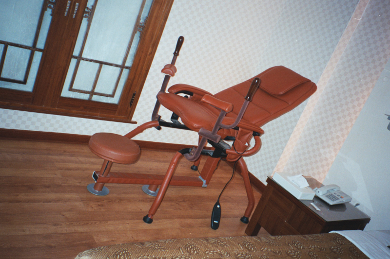
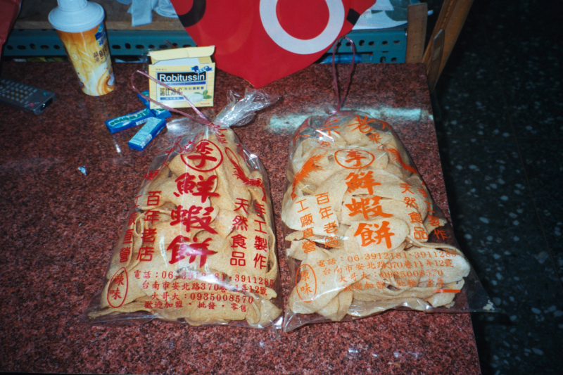

臺灣環島旅行，炎炎夏日，閒閒沒事，暑假消暑第一選擇。一個笨蛋，一個人跑去開車旅行，錢還沒帶夠，差點在屏東加霸王油。這是一場自由的夏天旅行。

## 汽車旅館的小插曲

在台南郊外的汽車旅館伴陪了一夜，清早醒來吃過早餐後，為了避免又在陌生城市迷路浪費時間，很快地就繼續開車往台南市出發。

*高雄汽車旅館情趣用品的八爪椅（羞）*

結果半路上突然靈機一動，想到既然是要去見心儀的對象，當然得讓方方面面都做到盡善盡美。即便是出門旅行，也要讓衣衫稍微整齊些，更有感的是汽車也要乾乾淨淨。結果，我很白痴的拿了洗面乳，就往皮椅上塗塗抹抹，天真以為這樣可以消除掉車內裝潢在這幾天累積的汗水味。

結果不亂搞還好，塗完後整個車內味道混雜在一起的異味變得超級噁心！最後只能送去蔬果市場對面恰好看到的一間洗車行進行車內清潔。

## 臺南約會與家人的指路

原本還想慢慢做全套清潔，但是眼看跟小華約好的見面時間已經到了，只能緊急喊停。結果雖然急忙趕過去，卻發現她已經站在大雨中良久。之後她這位在地人權當導遊帶著我玩了一整天。

晚上借宿小華家，享受了一段難忘的家庭氛圍。吃過早餐後，跟她一群家人討論如何才能接上高速公路。結果報給我一個沿著河岸走的路，其實讓我走的有點膽戰心驚，應該是當地人才知道的秘徑。離開她們家後不久，在路邊小卡車上買了幾包鮮蝦餅當作伴手禮。

*台南永安的鮮蝦餅*

好不容易從迷宮鑽出來後，正好可以直接開上北上高速公路交流道，看來小華爸跟姐夫報的路是連方向都最佳解的方案了，雖然對我這種開車新手來說顯得有點越級挑戰。

## 濱海公路與北返淡水

接著一路走到台中。因為不想再開高速公路，所以下交流道後走回我最愛的[西部濱海公路](https://mizuc.com/no-61-xibin-highway-from-favorite-to-annoying/)，沒想到那一段道路還沒蓋好被截斷，只得再改走一號省道。

結果後來又在苗栗迷路，在市區繞來繞去。行經三義時想買個木杯墊，卻發現那邊都是大型木雕，找不到店家有在賣這種小玩意。最後帶著臺南買的鮮蝦餅，跑去找朋友一起吃午餐聊天後，再開車平安返回淡水。

第四天的行程由於基本上都在臺南約會，所以沒有特別多寫。第五天則是全程加速北返，雖然在雲林鄉間稍微迷路一下，但最終順利結束這場難忘的冒險。

---

## 延伸閱讀

* [一個人的臺灣環島旅行：探索山海魅力美景](https://mizuc.com/a-person-taiwan-around-travel/)
* [臺灣環島：從淡水到花蓮](https://mizuc.com/a-person-taiwan-around-travel-day-one/)
* [臺灣環島：從花蓮到臺東金崙](https://mizuc.com/a-person-taiwan-around-travel-day-2/)
* [臺灣環島：從臺東金到高雄岡山](https://mizuc.com/a-person-taiwan-around-travel-day-three/)
* **臺灣環島：從臺南到淡水**