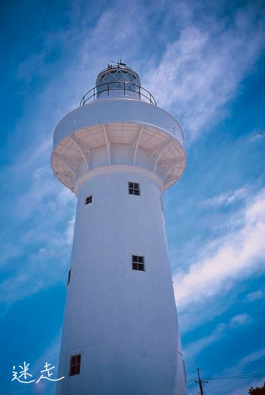
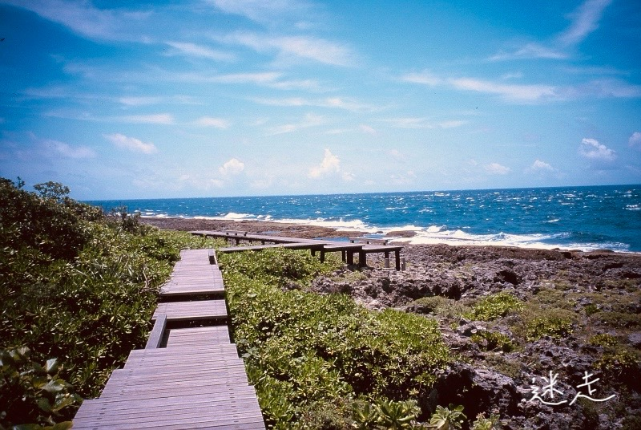
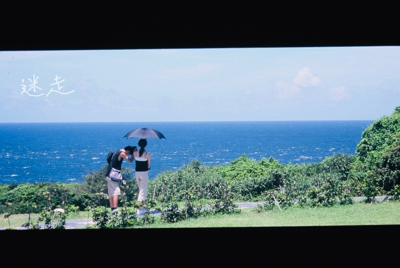
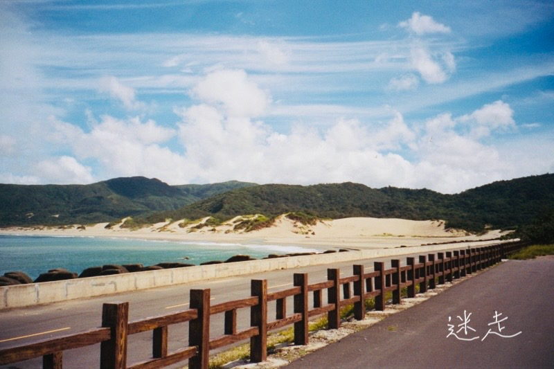
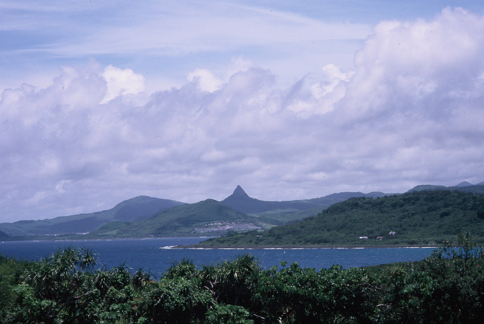
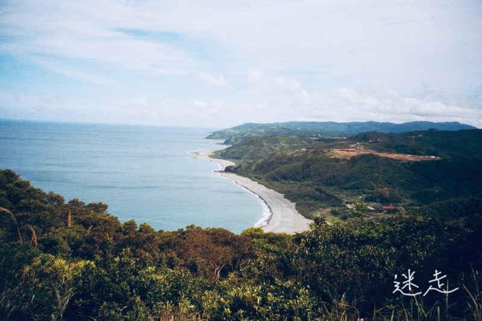
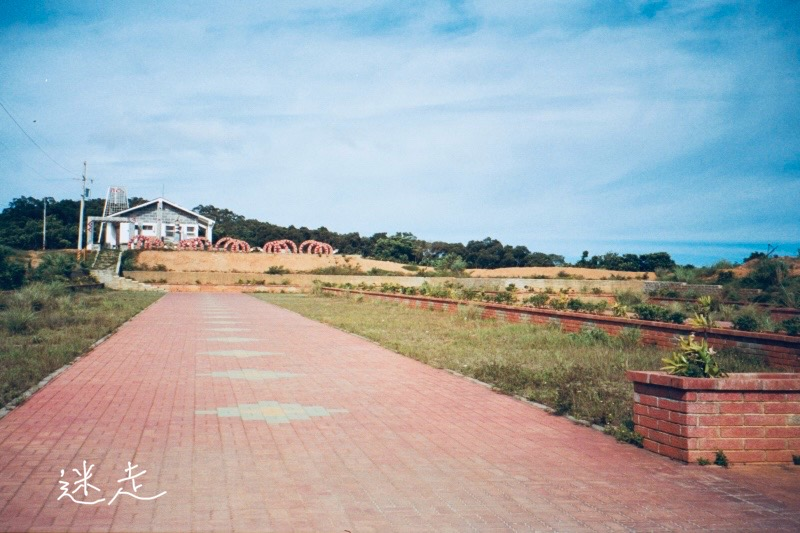
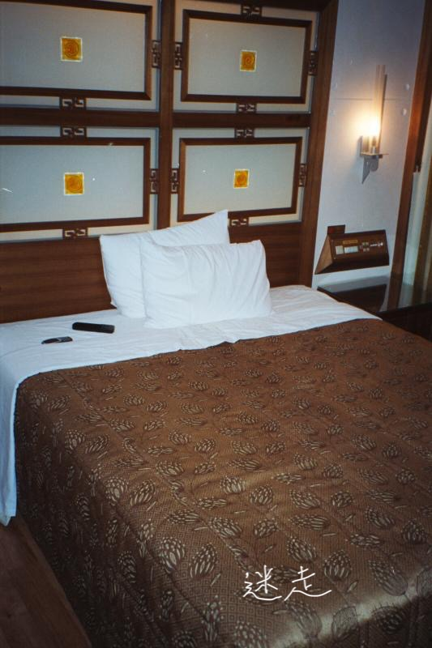

臺灣環島旅行，炎炎夏日，閒閒沒事，暑假消暑第一選擇。一個笨蛋，一個人跑去開車旅行，錢還沒帶夠，差點在屏東加霸王油。這是一場自由的夏天旅行。

## 金崙溫泉的早晨

在金崙溫泉旅社終於睡了這幾天來的第一次正經覺後，早早起來就離開旅館順便去野外覓食。好不容易在路邊隨便解決了一餐後，接著就是開車一路狂飆臺東公路，準備驅車殺往屏東。

遠離了城市，沿著美麗公路很順暢地走著，突然在路邊發現一條跟巷子般的產業道路，看著道路指標說可以直達旭海，算是一個意外的驚喜。正開心地轉進去後沒多久，驚慌地發現整條路上都是一台台砂石車從對向迎面開來，逼得我只能原路退出，改走回一般的南迴公路，最後還是繞了屏東一大圈才總算抵達目的地[旭海草原](https://mizuc.com/syuhai-grassland-recreation-area-southern-taiwan-island-roc/)。

途中在屏東的車城因為一路奔波，發現油箱見底準備加油時，身上現金竟然還沒帶夠！原本預計會收到的打工錢也延遲入帳，只能壓上身分證件先欠著汽油費用，急著打電話回家求救，請父親先去匯錢到我的郵局帳號。

## 鵝鑾鼻燈塔

很快地終於又有現金在身上後，沿著濱海的屏東公路一路狂飆，來到了鵝鑾鼻燈塔。夏天的太陽雖然非常酷熱，但實際上親自到了地方，其實也不會感覺到不舒適，這或許就是自然的好處吧。

*鵝鑾鼻燈塔*

這次自己一個人來，沒有任何的時間限制，便將整個公園逛了個透徹。有趣的是我在鵝鑾鼻公園裡面還意外發現一段有趣的插曲：有錢的老男人正在跟老婆講電話，美麗的年輕女孩默默跟在後頭。

*墾丁海岸步道*

啊，別誤會，下面照片是另一對可愛的年輕情侶。

*墾丁鵝鑾鼻的年輕情侶*

## 九棚大沙漠

下圖是過了鵝鑾鼻後繼續往前開，沿著省道台 26 線會來到一處九棚大沙漠，是中華民國各島嶼上相當大型的乾淨沙灘。附近還有中正理工學院，路上還能看到憲兵管制。後面有一處看起來相當舒服的黑色礫灘，偶爾可以看到有人正在那邊釣魚。

*中華民國臺灣省屏東墾丁的九棚沙漠*

## 旭海大草原

旭海大草原，位在縣 199 甲道路旁。想瞭解此地詳情可參考《[旭海大草原：台灣島境之南的絕色秘境與故事](https://mizuc.com/syuhai-grassland-recreation-area-southern-taiwan-island-roc/)》乙文內容。

*中華民國臺灣省屏東縣墾丁的大尖山*

*旭海大草原景觀*

*旭海大草原停車場（新建中）*

## 岡山汽車旅館

最後在屏東市又一次迷路。原本想買萬巒豬腳，卻沒買到有名氣的那間。六點左右到了高雄，再一次於市中心迷路，甚至搞不清楚高雄市跟鳳山市的差別。最終在岡山的汽車旅館過夜，享受這趟旅途中難得奢侈的睡眠環境。

*高雄岡山汽車旅館的豪華大床*

---

## 延伸閱讀

* [一個人的臺灣環島旅行：探索山海魅力美景](https://mizuc.com/a-person-taiwan-around-travel/)
* [臺灣環島：從淡水到花蓮](https://mizuc.com/a-person-taiwan-around-travel-day-one/)
* [臺灣環島：從花蓮到臺東金崙](https://mizuc.com/a-person-taiwan-around-travel-day-2/)
* **臺灣環島：從臺東金到高雄岡山**
* [臺灣環島：從臺南到淡水](https://mizuc.com/a-person-taiwan-around-travel-day-four-five/)