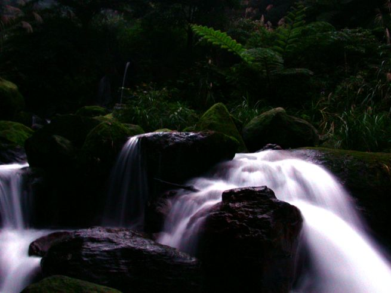
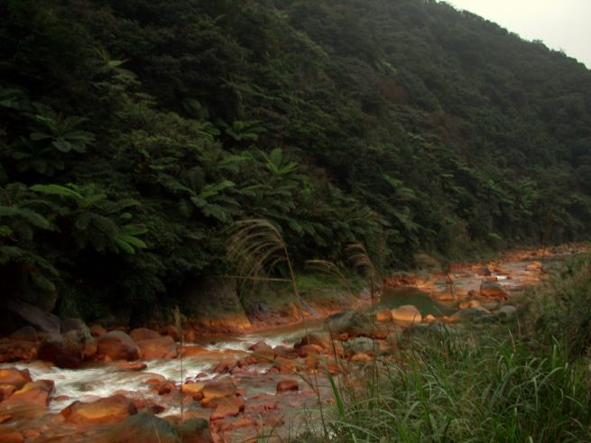
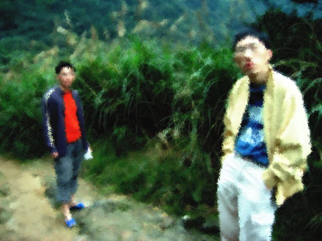
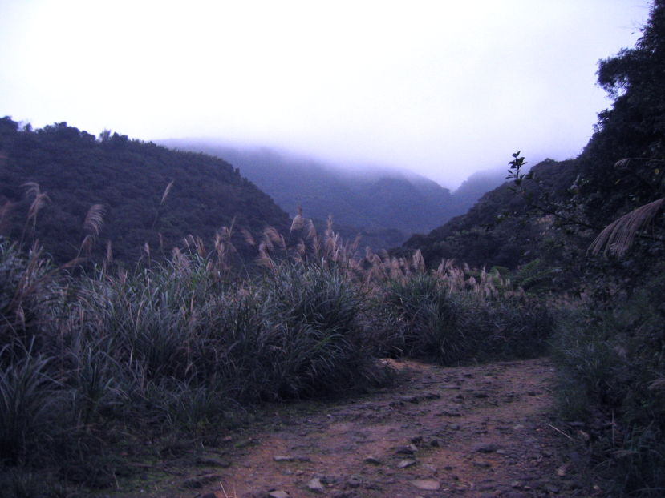
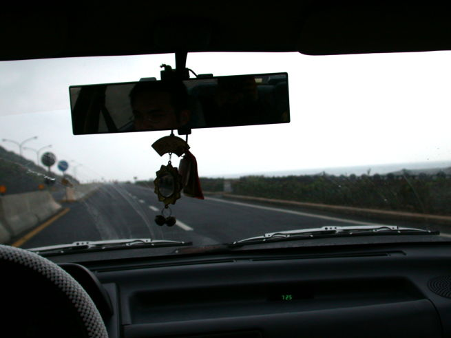

在新年前夕的寒風裡，我有過一段屬於迷走客的瘋狂回憶。

分享這次前往 **北海岸金山區 🇹🇼** 深處，探訪俗稱「5K 溫泉」的 **八煙野溪溫泉**（Bayan Creek Hot Springs）的秘境紀錄。

## 凌晨四點的瘋狂：手電筒與爛泥路

這是一場沒有預謀的遠征。凌晨四點，好友四人擠進一民的車，直奔陽金公路 5 公里處的入山口。

在那段沒有月光的凌晨，我們僅憑我預備的一支高亮度手電筒，在漆黑且充滿碎石、爛泥的原始山路中摸索了半個小時。當我們在五點抵達溪谷時，那種伸手不見五指的原始感，讓人深切體會到大自然的威嚴。

*清晨的八煙野溪溫泉，騰騰熱氣在月色褪去後若隱若現*

## 與資深泡湯客的「早課」

令我們驚訝的是，清晨五點多的溪邊，早已有一群「資深」的阿公阿嬤在享受熱騰騰的自然湯池。像我們這樣十幾歲的年輕人，反成了這片秘境中的稀有物種。

*破碎且陡峭的路徑，是進入這份禮物的必經考驗*

*一民與阿剛在山野間的合影，記錄下那份純粹的戰友誼*

## 迷走觀點：回首秘境

八煙野溪溫泉的魅力，在於它的「不可預測性」。雖然已被無數前人走出了路跡，但在夜間與雨候下，它依然保留著原始的野性。

當回程看著北海岸遼闊的海景，在車上累到陷入深沉睡眠時，我明白：這就是我們熱愛這片土地的原因——驚喜，永遠隱藏在不經意的轉角與勇氣之後。

*崎嶇的碎石路，見證了我們的凌晨步伐*

*回程途中，北海岸公路上那抹治癒人心的蔚藍*