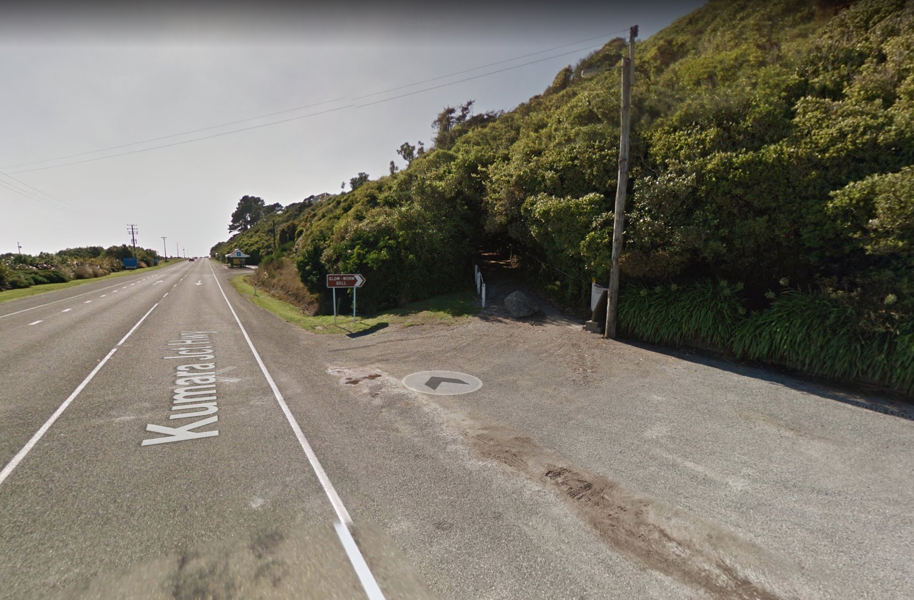

想看澳大利亞（Australia，簡稱澳洲）與紐西蘭（New Zealand）那充滿黏液、長腿與美麗藍光的國寶嗎？

除了知名的北島懷托摩（Waitomo）以及南島蒂阿瑙（Te Anau）兩大付費螢火蟲岩洞探險外，在紐西蘭南島西邊的一個小鎮「霍基蒂卡」（Hokitika），鎮門口附近還有一處堪稱私房景點的 **Glow Worm Dell** 藍光螢火蟲山谷。

這座山谷位於大馬路旁，遊客只要從入口走路進入樹林，不到五分鐘就能輕鬆飽覽迷幻的藍色光牆景觀。這可是其他昂貴的商業探險行程所無法比擬的靜謐體驗。

*紐西蘭南島 Glow Worm Dell*

---

## Glow Worm Dell 旅遊資訊

* **地址**：Kumara Junction Highway, Seaview 7882, Southern Island, New Zealand
* **費用**：免費參觀
* **開放時間**：全天候 24 小時（建議於完全天黑後前往效果最佳）
* **聯絡電話**：+64 3-755 6166

> **迷走小叮嚀**：觀賞螢火蟲時請保持安靜，並切勿使用強光手電筒或閃光燈直接照射，以免破壞自然生態並影響他人觀賞。