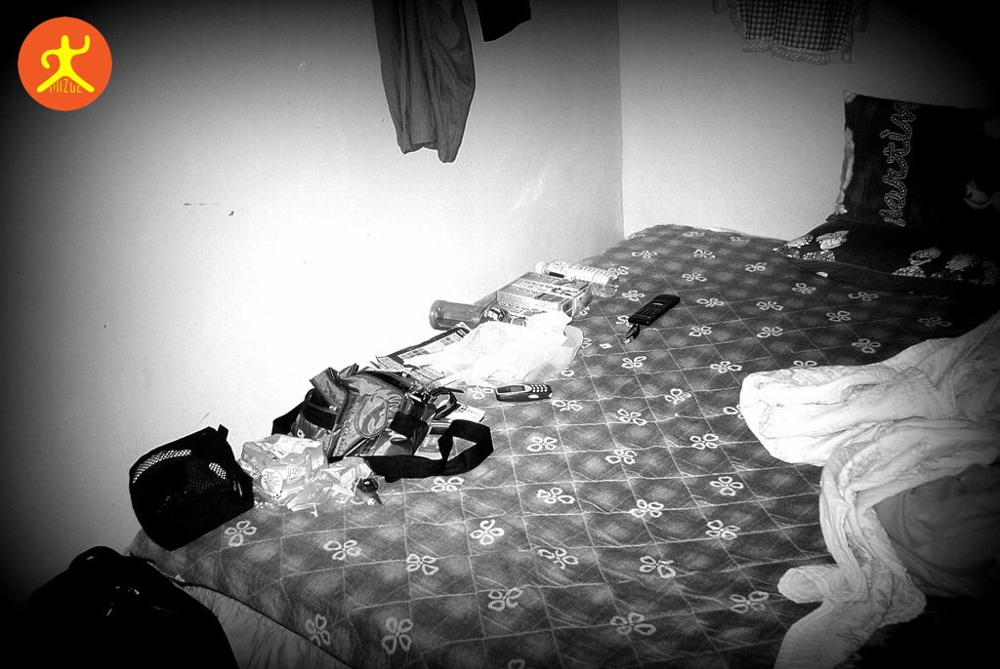

在學生時代結束的那年夏天，我展開了人生第一次獨自開車環島旅程。在連續奔波一天半、僅在花蓮七星潭車宿三小時後，我拖著疲憊的身體抵達了台東金崙。

## 迷途後的棲身之所

在沒有 **GPS** 的年代，我翻開手中泛黃的旅遊手冊，鎖定了當晚的落腳點：**金崙溫泉旅館**。在一段產業道路上的自我迷航後，那棟醒目的建築物終於出現在眼前。

沒想到，旅館接待我的竟是一場圍繞著門口炭火的烤肉派對。老闆與親友們顯得對我這位「不速之客」相當意外。更令人意外的是，住宿價格已從手冊上的 800 元漲到了一千元，且不包含早晚餐。

## 60 年代的極簡生活

當我推開房門，一股濃厚的濕氣撲面而來。
1. **空間**：整個房間幾乎被雙人彈簧床填滿。
2. **視覺**：一台 15 吋電視高掛在天花板一角，毫無切換頻道的動力。
3. **通風**：令人震驚的是，房間竟然**沒有窗戶**。

在那個沒有 7-Eleven 的地段，我的晚餐最終是由附近雜貨店的泡麵充當。

*金崙溫泉旅館的房間實景*

## 溫泉花的慰藉

儘管房間硬體一般，但這裡的溫泉確實是貨真價實。浴室裡的浴缸採用了 60 年代最經典的**碎磁磚拼貼設計**，充滿古樸氣息（雖然清潔程度讓女孩子可能敬而遠之）。

流出的溫泉水夾帶著許多溫泉花，熱度驚人且泉質滑順。那一晚，我整整泡了三次，將沿途累積的疲憊徹底洗淨。

後來得知這間旅館在 2009 年的莫拉克颱風中毀損。如今重溫這段回憶，心中那抹充滿霉味卻又溫暖的溫泉香，依然是那場青春環島中不可或缺的味道。

---

六、參考連結

* 🏨 **旅館住宿**：[查看最新訂房優惠](https://oon.me/agoda)
* 🚗 **自駕租車**：[租車方案查詢](https://oon.me/rentalcars)