在一次隨意相約的場合下，一場預定五天的環島之旅就這樣臨時訂下了。這次不光只有我跟謝宗翔（暱稱小翔）這兩位本來就經常相約環島的老戰友，特別加入一名我們共同的專科同學「年獸」。下面是我們第四日從臺東的知本溫泉返家的行程紀錄。

一早在知本溫泉飯店的房間睡醒，年獸向還在朦朧中的我們說要去游泳，一個人就帶著泳衣跑出去了。下面照片是我從房間陽台往游泳池拍攝的照片，一早沒有人，不過昨晚從同樣的角度往下看，人潮就很多了。只是都是媽媽和小孩居多。

我的年輕辣妹呢？都跑去哪了？（被毆）

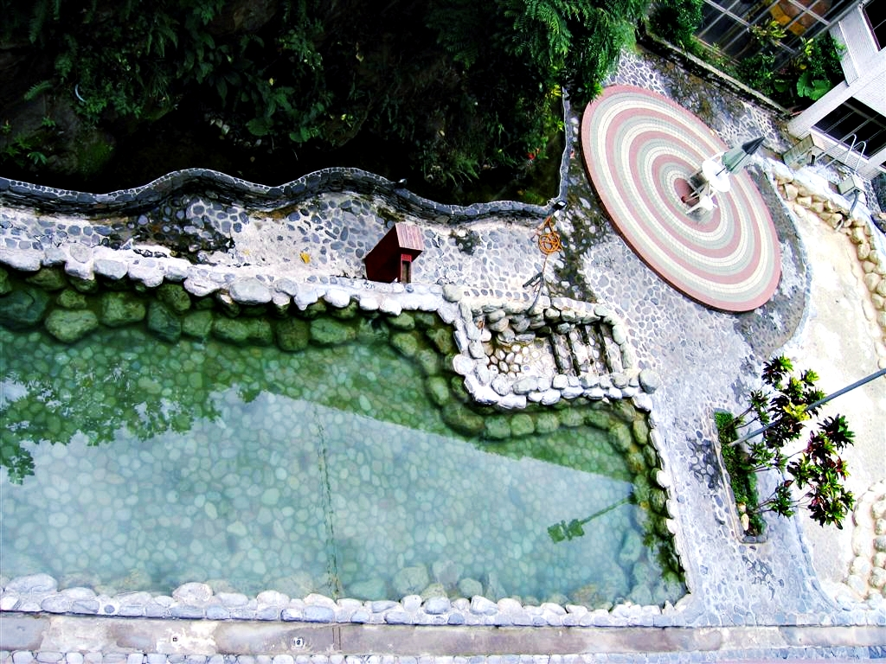
*知本溫泉飯店的游泳池*

從房間看出去，在飯店後方的大樓，蠻有生活感。有人曬衣服跟拖把，有的還有遮雨棚，像是一般公寓住宅的房間。能住在這種偏僻的知本，還特地住在集合型住宅，感覺是用來度假專用。

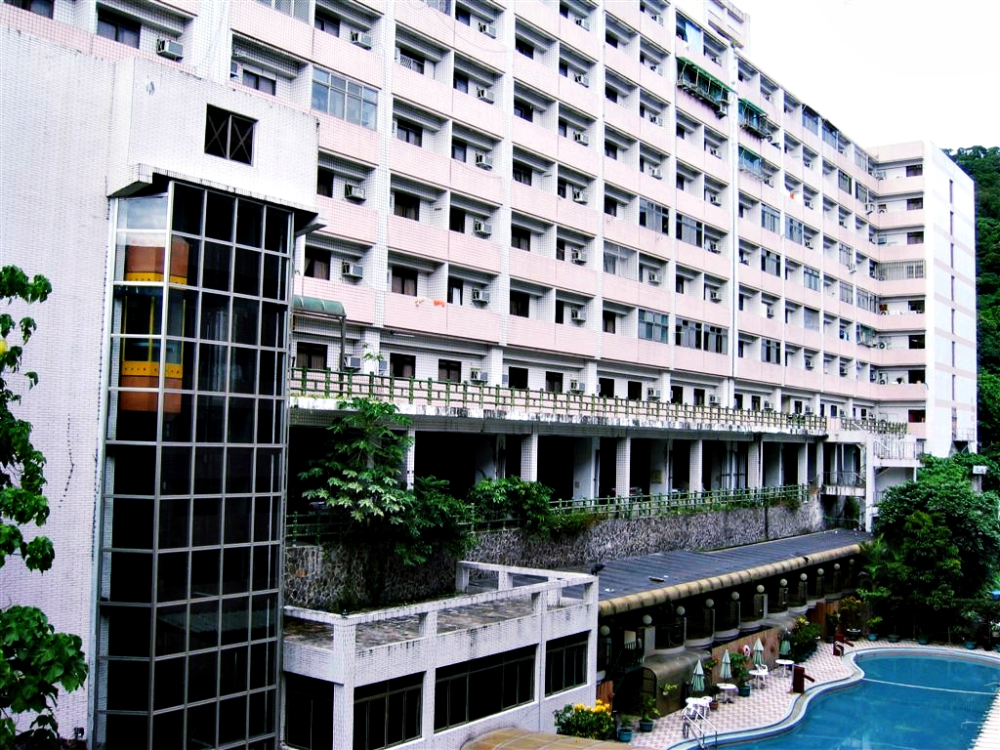
*飯店後面的大樓*

雖然不記得飯店名字，不過入口處長相如下。以後去知本的人，一定要指定我們 540 房．的．對．面．喔！

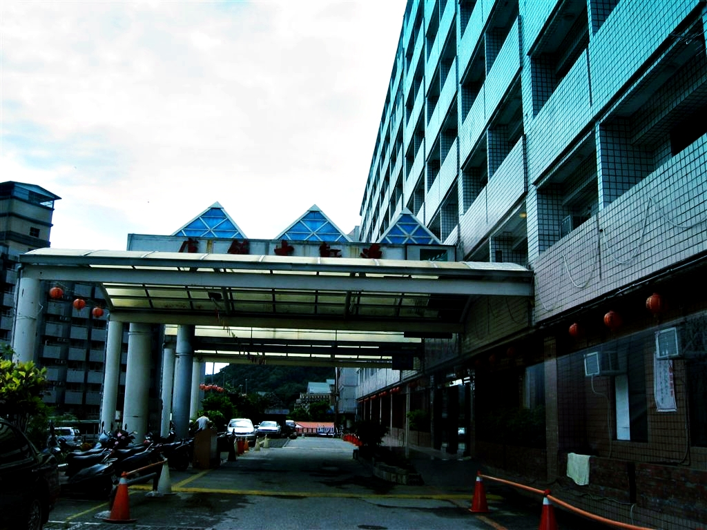
*知本溫泉飯店的大門*

吃完早餐、整理好行李後，就是準備快樂的返家車程了。今天走的是海線，雖然不能環島，也算是環花東了（遠目）。在經過一段海岸線時，我們還看到一朵像極了大恐龍的烏雲。我們三人都興奮地把車停在路邊後瘋狂拍照。既然昨天都能遇到空島了，這隻大恐龍一定就是住在空島上的生物了。

下面照片是臺東最先開始出名的肉包子店「東河肉包」，這也是我心目中中華民國四大肉包之一，和民雄肉包、鹿港肉包與新竹黑貓包齊名。

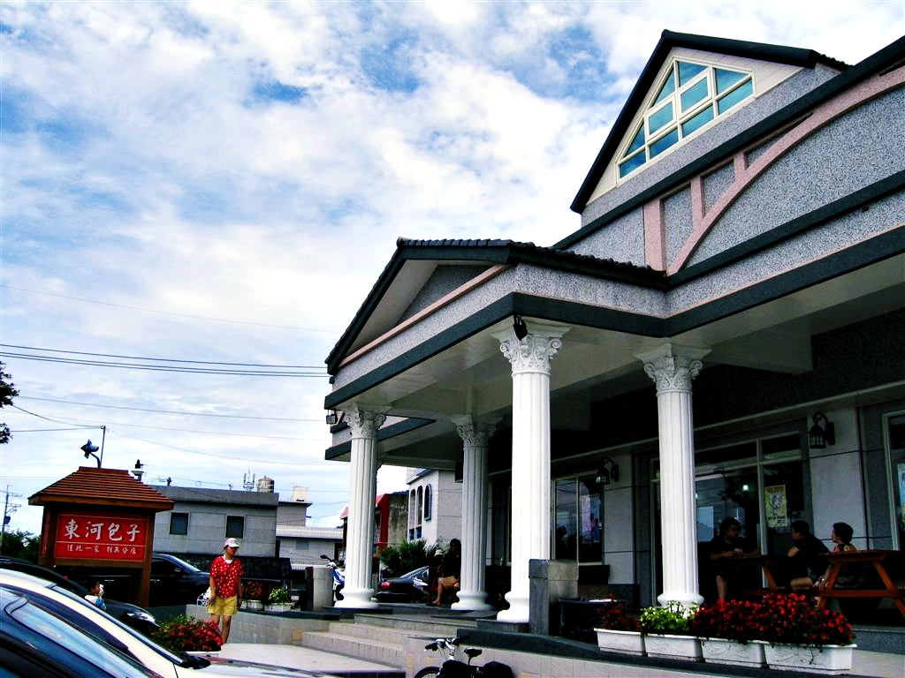
*台東「東河包子」*

以前還是一間位在小村裡的純樸早餐店，大概是出名後賺了不少，搖身一變就成為這種豪華建築了。雖然兩家店的調味可能都一樣，不過實際口感似乎比以前差了一些，幸好老店還在，一起吃多少感覺得到差異。

我第一次知道東河包子這家店，是二技畢業旅行時的遊覽車司機大哥帶來的。只是當時太多遊覽車都帶人來買，還沒輪到我們就已經售罄了。記得當時的導遊小姐還為此替我們感到飲恨（咦）。

繼前幾天的臺北俗 PART 2，這次是位在海線上的北迴歸線。

> **北迴歸線標誌**：全球一共有 9 座北迴歸線碑，中華民國就有 3 座北迴歸線標誌。一座位在臺灣島西部的嘉義縣水上機場，一處在臺灣島東部的花蓮瑞穗鄉台 9 線上的舞鶴鄉（海岸公路），一處在臺灣東部的花蓮台 11 線豐濱鄉的靜浦村（花東縱谷）。

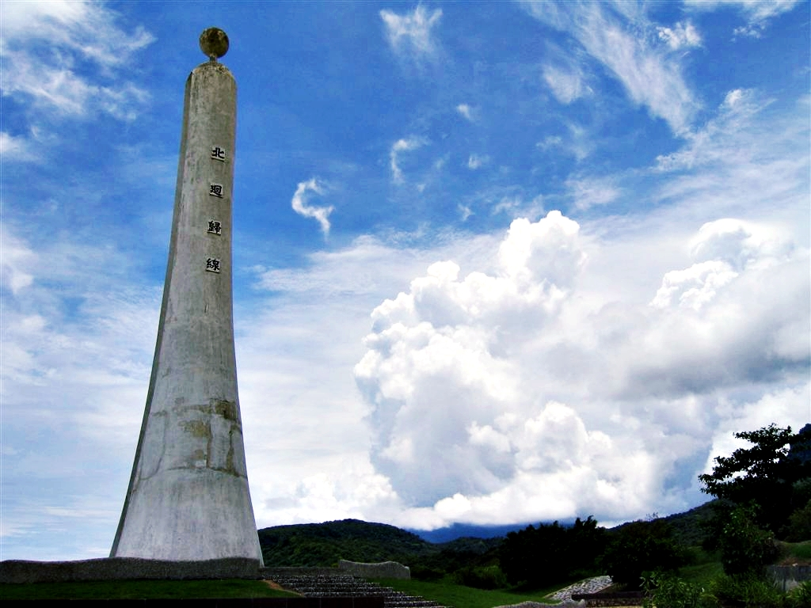
*北回歸線（海線）*

用不一樣的角度再拍一張剪影，挺具有戲劇效果的。

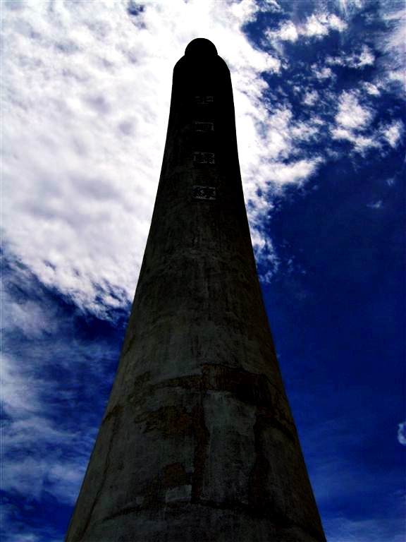
*北回歸線*

下面照片是我們來到花蓮的大漢技術學院時隨意拍攝的 7-Eleven 照片。以前剛從元培科技大學的醫學工程系（二技部）畢業時，我一個人開著車環島的一個目的地就是想來小華的母校參觀。第一天晚上也是在這家小七買了吐司後帶著去[七星潭](https://mizuc.com/a-person-taiwan-around-travel/)過夜。

晚上直接睡在車上，除了夏天的熱氣外，還有玩車的跑去那邊試車廂音響，讓人幾乎是一夜難眠。隔天一早還跑去附近的早餐店吃早餐，順便去參觀小華生活過五年的學校。

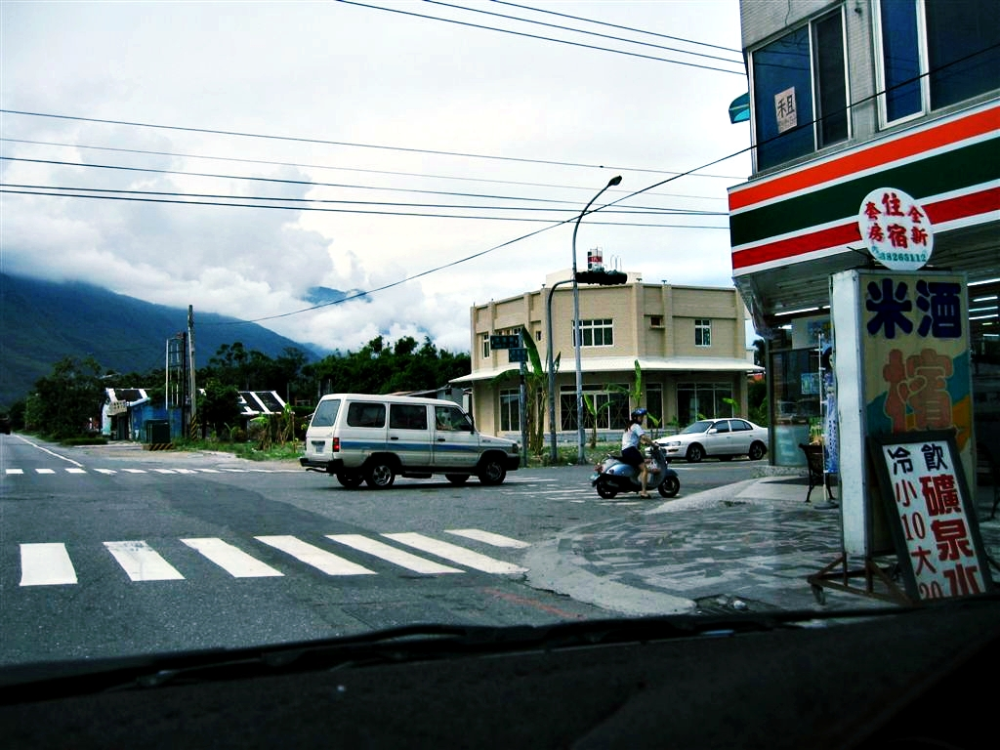
*花蓮大漢大學外的 7-Eleven*

大漢技術學院的校門口，上一次環島因為只帶著尼康 Nikon FM2 底片相機，也沒有拍太多照片，這次算補拍吧。

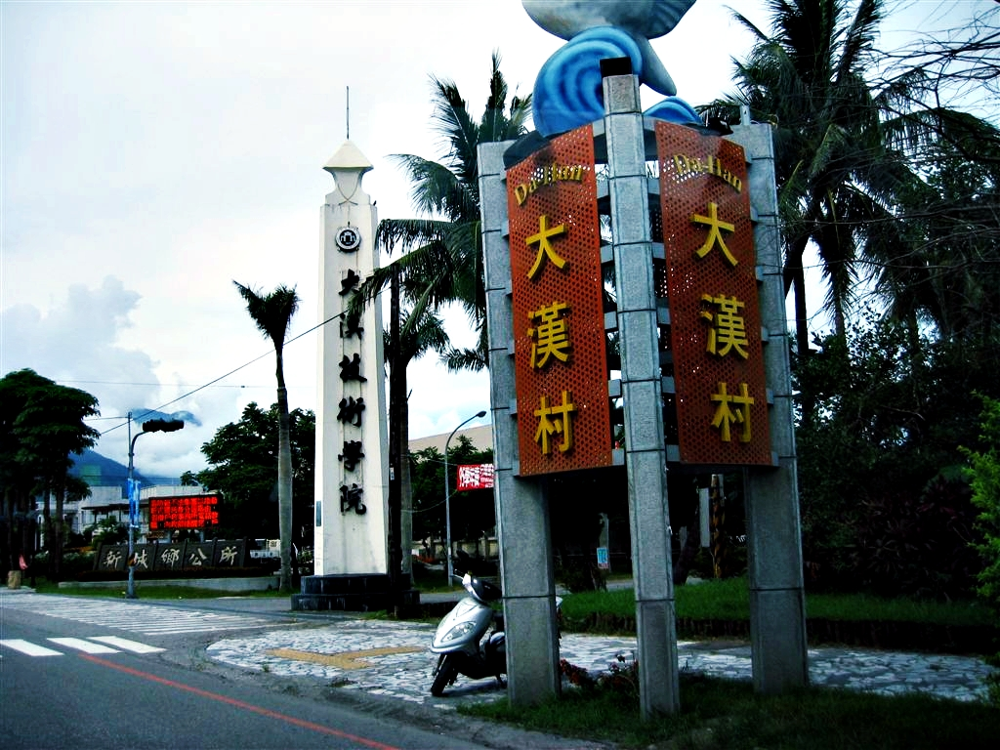
*大漢技術學院的校門*

接著就是每個開車去花蓮都會經歷過的一件事：「塞車回家」。明明也不是假日，到了雪山隧道依然塞車中。

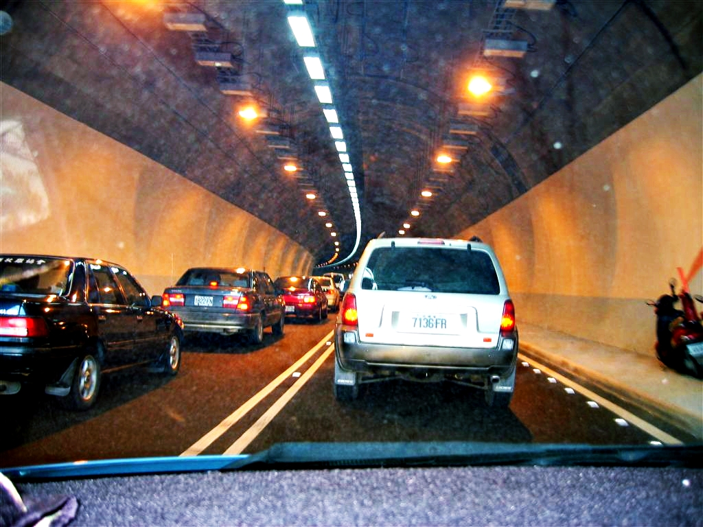
*雪山隧道塞車中*

最後用超長 12.6 公里的隧道尾巴來替這次環島旅行（失敗篇）做一個結尾（超累）。

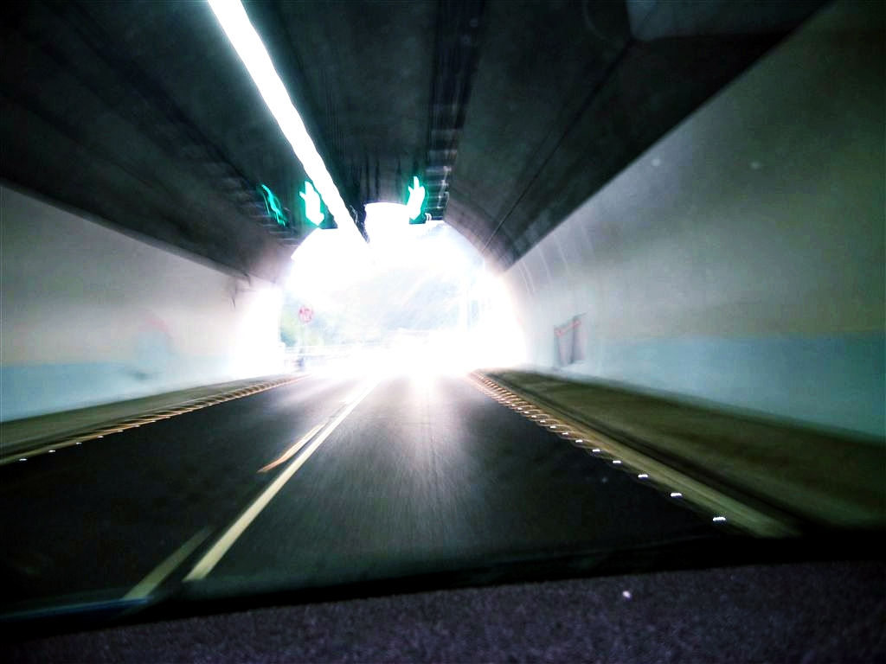
*雪山隧道出口*

歸賦，連太陽公公都來道晚安。

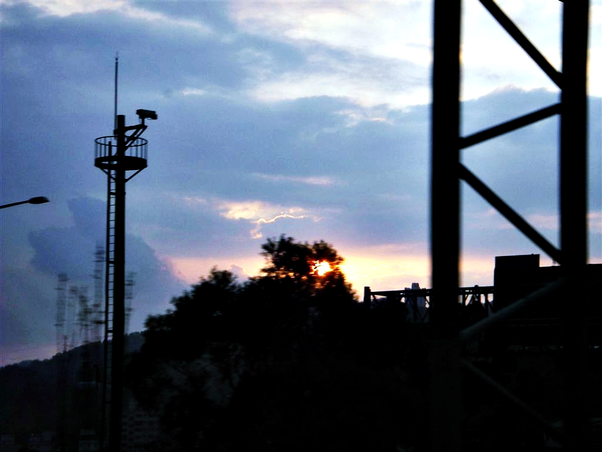
*國道上的太陽公公*

---

## 台灣花東迷走基本資料

* **旅遊期間**：民國95年08月01日到04日
* **迷走成員**：Lin, Jin-Liang、謝宗祥、年獸
* **交通工具**：迷走號
* **里程累計**：1240公里
* **全程計時**：第一日早上七點半到第四日晚間九點
* **最高高度**：2552.9公尺（地點：N24 11.038 E121 18.379）
* **行程摘要**：
    * **第一日**：淡水 → 新店大潤發 → 雪山隧道 → 宜蘭 → 武陵農場
    * **第二日**：武陵農場 → 梨山 → 太魯閣 → 花蓮市 → 紅葉溫泉
    * **第三日**：紅葉溫泉 → 瑞穗牧場 → 池上 → 太麻里 → 知本溫泉
    * **第四日**：知本溫泉 → 花蓮市 → 蘇花公路 → 雪山隧道 → 淡水

*花蓮、台東四日環島路線地圖*

## 延伸閱讀

* [花蓮、台東四日環島旅行：颱風攪局之第1日](https://mizuc.com/hualien-and-taitung-tourism-day-one/)
* [花蓮、台東四日環島旅行：颱風攪局之第2日](https://mizuc.com/hualien-and-taitung-tourism-day-two/)
* [花蓮、台東四日環島旅行：颱風攪局之第3日](https://mizuc.com/hualien-and-taitung-tourism-day-three/)
* [花蓮、台東四日環島旅行的旅費紀錄（餐飲、住宿、小吃、飲料）](https://mizuc.com/hualien-and-taitung-four-days-tourism-funding-record/)