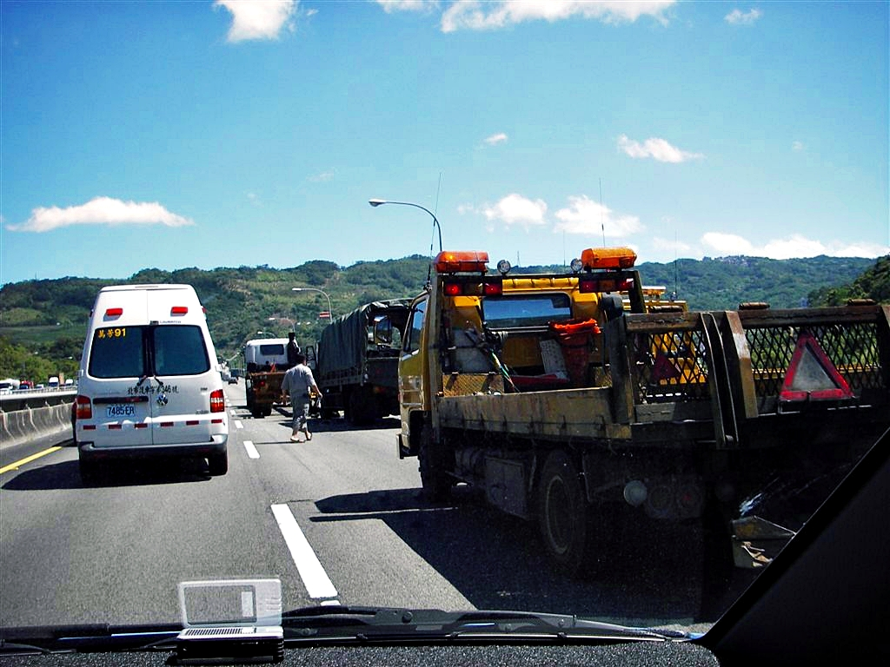
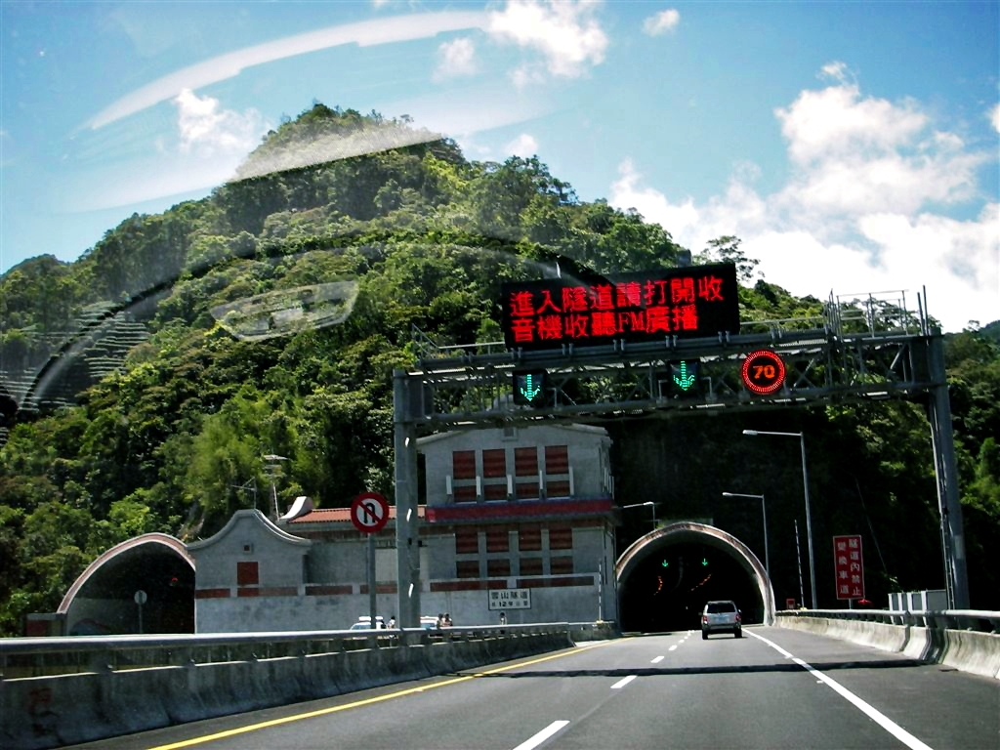
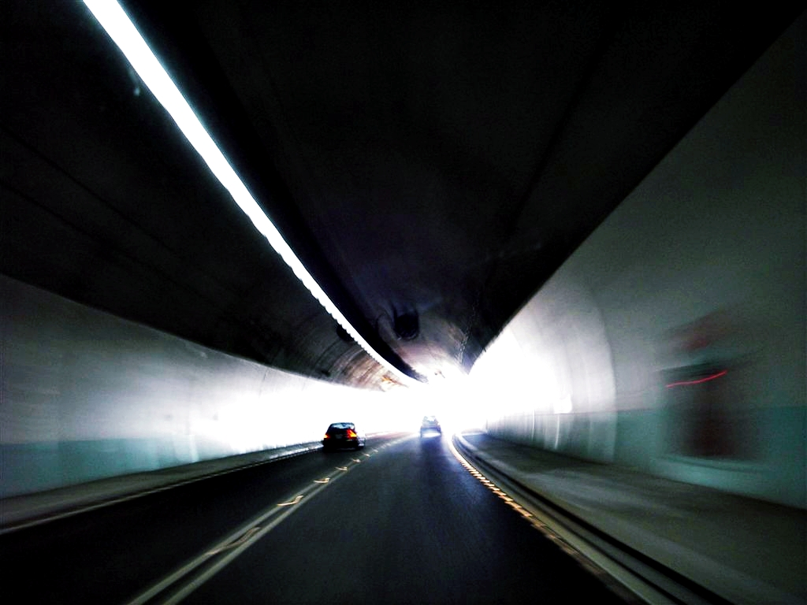
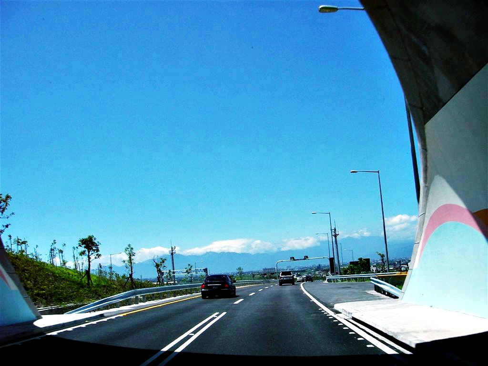
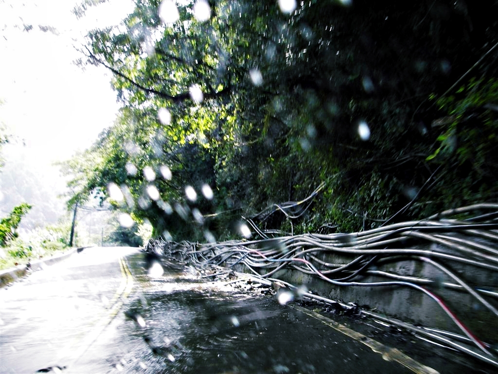
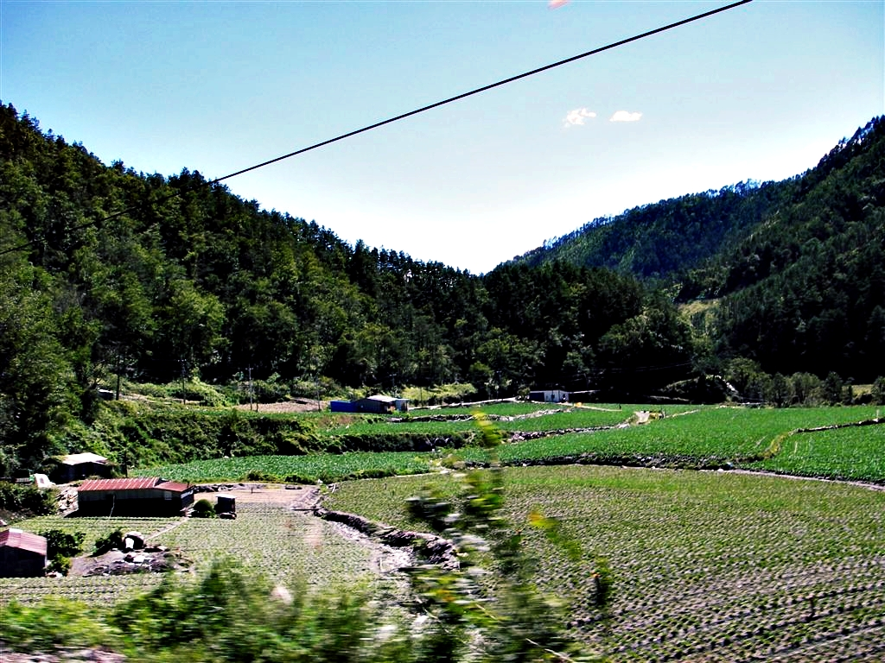
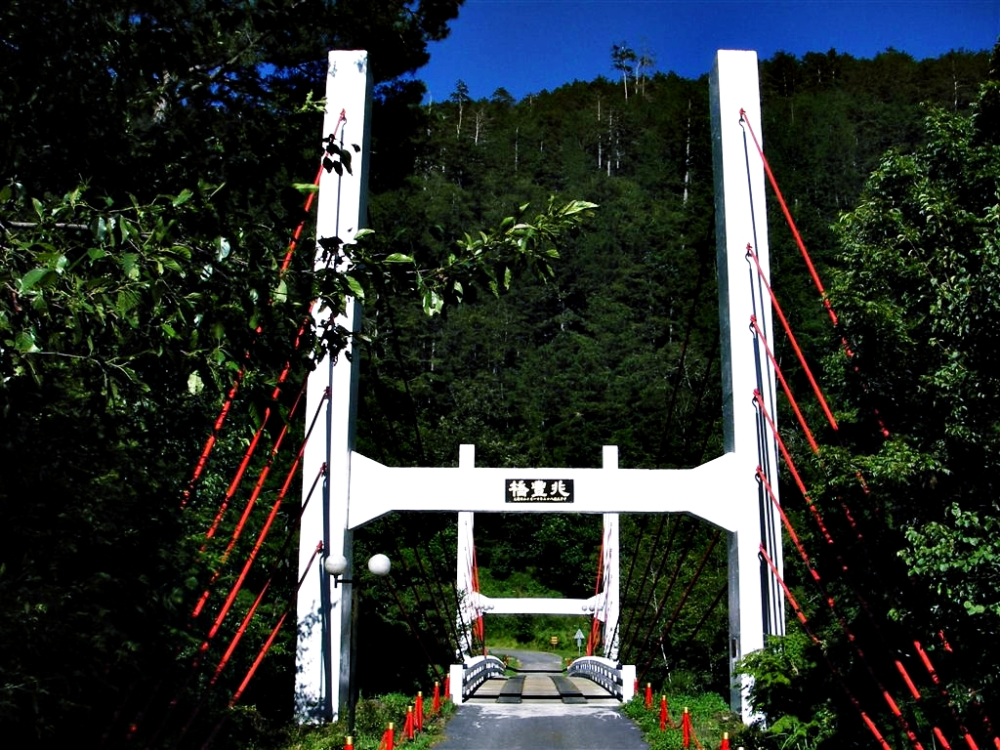
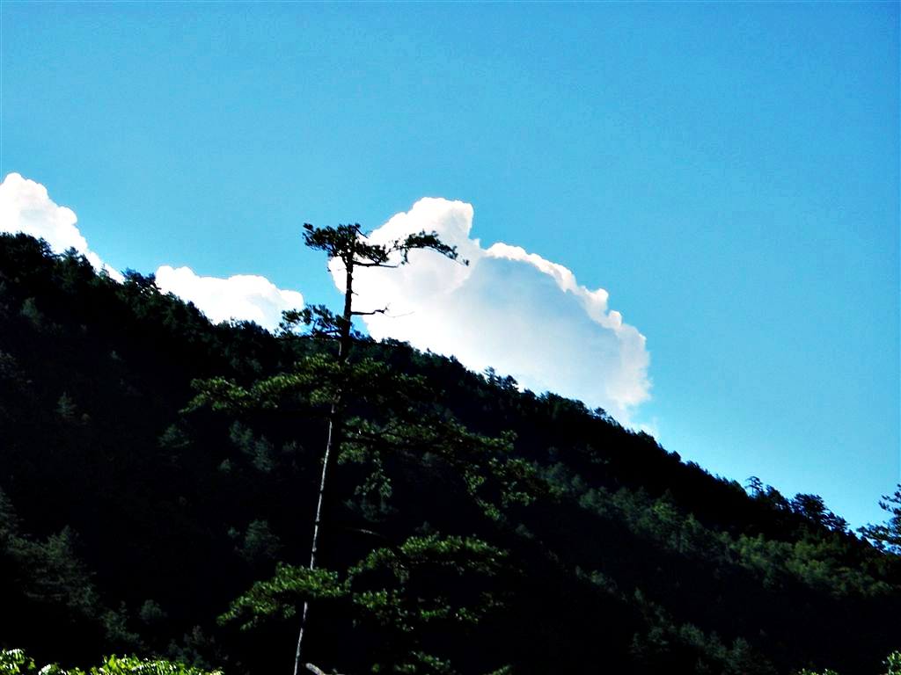
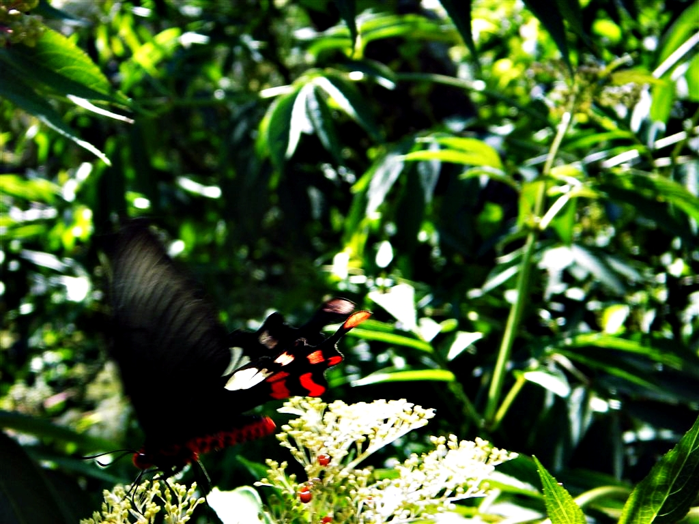
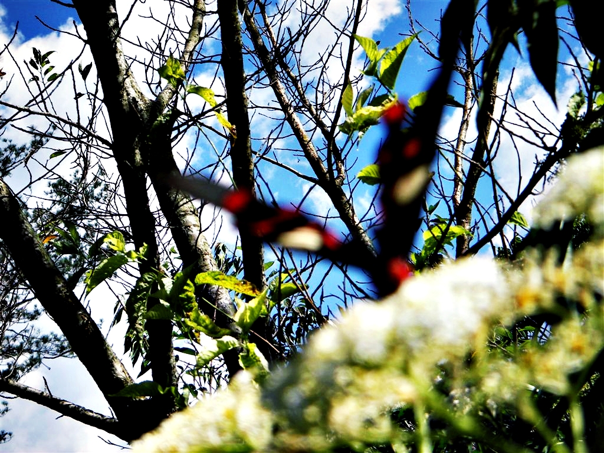

一次隨意相約的場合下，預定五天的一場環島之旅就臨時訂下了。這次參加迷走之旅的人，不光只有我跟謝宗翔（小翔）這兩個本來就經常相約開車環島的老戰友，新成員是我們共同專科同學「年獸」。下面是我們第一日從淡水到台中武陵農場的行程紀錄。

一早開著車，在淡水的紅樹林捷運站還有新店的大潤發外面分別接小翔跟年獸上車。

既然車都開到大潤發，順便採購接下來幾天所需要的食物還有燃料。

說是食物，也是些糖果餅乾之類的點心（還有啤酒），純粹在路上打發時間用（靠啤酒）。燃料是高山瓦斯罐，怕不小心又得露宿荒郊野外時，好歹能煮個泡麵來吃（配啤酒）。

逛完一輪賣場採購完後，便搭上迷走號朝今天第一站目標「雪山隧道」前進。

雖然一夥人的心已高歌飛往美麗的台灣東部，現實卻是立刻陷在中華民國國道三號（北二高）。直到終於通過塞車結點後，才發現又是車禍。

車禍也就算了，偏偏還是軍用卡車跟貨櫃車發生追撞事故！兩輛巨無霸佔據著高速公路好幾線道，雖然還剩下一線道可供通行，不過華人名產插隊車可不是浪得虛名，所有車輛只能緩慢行駛也是意料中事。

國道三號車禍現場

尤其啊，那種從最內側車道慢慢移到最外側後，又摧估拉朽般切回最內側車道的那種莫名其妙的車輛，永遠是我們駕駛最鄙夷的對象。

反正我是永遠不可能理解那些連基本的道路常識都不懂的駕駛。我只好善盡良心，幫他們想些理由。例如老婆快生了，或是一些... 嗯，還是別說的好。

總之，每次遇到那些自以為開車很厲害的[三寶駕駛](https://mizuc.com/dangerous-jeep-driver-appear-on-the-north-coast-and-tamsui/)時，只要腦袋這樣一想，內心就能神奇地用寬宏大量視角看待插隊行為。

總算通過車禍現場後，隨即很快地切入編號為中華民國國道五號的蔣渭水高速公路（通稱北宜高速公路），不久，就看到一個隧道，什麼什麼山隧道，前面幾個字剛好被電燈桿遮蓋看不見。內心一陣陣驚喜，難道這就是所謂的雪山隧道？

我們在駛進隧道前就已經開始狂拍，準備記錄下這條新路的一切。

但是進入隧道沒多久卻立刻看到出口，我們三人的頭上就像是飛過幾隻烏鴉，內心只有點點點點點點可以形容。

後來又開過幾個隧道後，我們終於肯定接下來的一定才是正牌的雪山隧道。但是路牌上寫雪山隧道總長有 12.6 公里，會不會有點給他太長了些？

雪山隧道入口

而且不僅隧道長，連開車限制都能列出一長串，例如速限必須維持在50至70公里間、開頭燈、保持車距50公尺等等。讓我們這種身性自由的開車駕駛感覺綁手綁腳，只覺得跑雪山隧道非常單調，還有些後悔。

雖然走雪山隧道可以很快從台北接到宜蘭，不過沒必要的話還是寧可跑北宜或濱海。如果有人笑我繞遠路的話，就假裝我有幽閉恐懼症好了。

這是我跟小翔兩人第一次走雪山隧道，大家心裡都充滿著好奇，不曉得和曾經走過的新竹鳳鼻隧道有什麼不同。

> 鳳鼻隧道是省道台61線的一段路，全長2250公尺，起點在新竹縣新豐鄉的海岸線附近，終點在竹北市，特徵是全台最長的明隧道，也是最長的假隧道，採用棚架式隧道設計，沿線開設複數個孔洞對著天空。行人可以走在隧道內靠山的一側，我曾經走過一次，強烈建議不要碰到牆壁。

雪山隧道內部最為人熟知的就是沿線架設大量監控攝影機，而且還是傳說中可以從頭罰到尾的數位攝影機。

無論你是超速或車距不夠長，都可以在事後連續舉發，讓人直呼政府真是窮到用搶的。

開在隧道內也稍微計算了一下，如果以時速60KM與約15秒即出現一台攝影機的計算後，可發現隧道內每250公尺就有一台攝影機。

計算完後我內心又默默說了一次：「政府真是缺錢呀！」大概都被浪費跟貪汙花光了（遠目）。

雪山隧道的那道光

身為一名專業的科技宅，在這種時候也就會不自主想試試看傳說中的隧道無線電。我們特別在進隧道前就打開車上收音機，並且轉到警廣廣播電台。

在進隧道前只會聽到喇叭發出滋滋滋的雜訊聲音。在進入隧道後約100公尺左右，就能聽到收音機像是被硬切換到隧道廣播，由此可知……………………我其實沒想法，只是單純寫下當紀錄。

「咳咳！」

總之，開著車經歷過漫長的12多公里後總算發現出口就在前方。這時候我滿腦子只想把車停在路邊，打開專程帶出來的車用冰箱，把冰涼的啤酒灌進喉嚨裡。

從雪山隧道出口出來後，只見一片的藍天與遠方的夏季型海洋性氣候所導致的層積雲，不虧是宜蘭，好寬廣的視野。

不過我得老實和大家說，宜蘭的空氣品質其實很糟糕。即使有些人在誇耀陳定南趕走六輕的同時，他們卻選擇性沒看到這個真相，往往輕易地就被宜蘭好山好水的政策宣傳辭令誘惑了。

根據中華民國氣象局公佈的酸雨值來看，宜蘭的空氣有時候甚至比台北市還糟糕，不過這邊就當給各位補充個常識好了，說太多只會招來網軍攻擊。

雪山隧道出口（宜蘭方向）

沿著國道五號開下交流道也到了下午一兩點，隨便找了間號稱「開業五十年」的魚丸冬粉店。

既然來到以食物立名的餐廳，那點一碗魚丸冬粉也是理所當然的事。

嘛，雖然上面一句根本是廢話等級，不過偏偏有人硬是要點魚丸板條。只能賞年獸四枚白眼球。

將魚丸冬粉塞進胃裡後，我順便到隔壁的郵局辦理駕照換照手續。這就是懶人旅行法的最高境界，將原本在家附近要完成的事情，在旅行中完成更有成就感。

> 2018.11.09：今天整理這個段落，想起五月的[499之亂](https://www.vedfolnir.com/technology/hardware/mothers-day-promotion-of-cht-mobile-phone/)，台灣島上各地中華營業廳到處排了長長人龍，我卻悠哉的跑道馬祖列島的北竿營業廳申辦，現在一個人都沒有（遠目）。

接著，一行人又往太平山前進，到了太平山管制中心後，本來是打算進去太平山順便看看有沒有空房間的，只是旅伴似乎是並不願意住在那邊，想著，既然不住在那邊也就不需要浪費那個入山費了，於是，隨即朝武陵方向前進。

走進山裡的路上，不時能發現馬路旁山壁上滿佈著一條又一條的水管，水管甚至隨著鐵橋橫過山溝，令人不禁聯想到國中時玩過的一套遊戲「黑暗之蠱」，遊戲內容跟畫風在我腦海中留下深刻的印象就如同這些水管。

無邊無際蔓延的水管似乎年久失修，斷的斷破的破，水都像噴泉般噴到馬路上，有些路段更像自動洗車機一般，十來條水柱在噴著，更誇張的，其中有一個地方的水管是橫跨過馬路上方的，水就這樣大量漏了下來，我也索性停在下方，就當洗車吧，忽然想到有開天窗的車經過的話，一定很精采。

往武陵農場路上的省道台七線

往武陵的路上不斷印入眼簾的一片又一片田野風光，滿滿的綠意，恰好可以讓駕駛的疲累眼睛獲得短暫的休憩。

省道台七線上的田園風光

話說回來，武陵的入園費也是爆貴的，比起太平山有過之而無不及，不僅要算人頭還要算車頭，入園後，在遊客中心對面有著一座吊橋「兆豐橋」，橋的對面有著茶園，還有無數隻翩然於花叢間的曙鳳蝶，極搶鏡頭。

武陵農場兆豐橋

在山頭的一角處，有著平地不易見到的可愛雲朵，美麗的藍白漸層，更令人驚豔。

武陵農場的白雲飄飄

正在汲取花蜜的曙鳳蝶，完全不查一旁的變態狂魔正拿著相機瘋狂偷拍著。

曙鳳蝶汲蜜

笨蛋，人都殺到正面了，還一副渾然忘我的樣子，忽然想到一首歌「蝴蝶蝴蝶生的真美麗………」，蝴蝶的美麗色彩到底是誰決定的呢？

曙鳳蝶的美麗身姿

第一天晚上，我們住在露營區旁的武陵山莊大通舖，二千二元的房價硬是殺到二千，不過沒有冷氣也沒有電視，硬體設備算是相當簡陋。

其實要是有攜帶帳篷、睡袋的話可以直接去睡外頭棧板了，便宜快五倍。

題外話，為了讓夜晚更加快樂些，我帶了一組新買的海盜桶去，沒想到竟然讓幾個大男生玩到瘋狂！不過大概是買便宜貨的關係，玩了一陣子後就把桶身內一個重要零件給扯斷了，索性把海盜留在山上。

## 武陵農場資訊

*   地址：中華民國424台灣省台中市和平區平等里武陵路3-1號
*   聯絡電話：04-25901259。
*   官方網站：[武陵農場](http://www.wuling-farm.com.tw/)。

## 台灣花東迷走基本資料

*   旅遊期間：2006年08月01日到04日。
*   迷走成員：林金亮、謝宗祥、年獸。
*   交通工具：迷走號。
*   里程累計：1240公里。
*   全程計時：第一日早上七點半到第四日晚間九點。
*   最高高度：2552.9公尺（地點：N24 11.038 E121 18.379 )。
*   迷走行程：
    *   第一日：淡水→新店大潤發→雪山隧道→宜蘭→武陵農場。
    *   第二日：武陵農場→梨山→太魯閣→花蓮市→紅葉溫泉。
    *   第三日：紅葉溫泉→瑞穗牧場→池上→太麻裏→知本溫泉。
    *   第四日：知本溫泉→花蓮市→蘇花公路→雪山隧道→淡水。  
        

花蓮、台東四日環島路線地圖。

## 延伸閱讀

1.  [花蓮、台東四日環島旅行：颱風攪局之第2日](https://mizuc.com/hualien-and-taitung-tourism-day-two/)。
2.  [花蓮、台東四日環島旅行：颱風攪局之第3日](https://mizuc.com/hualien-and-taitung-tourism-day-three/)。
3.  [花蓮、台東四日環島旅行：颱風攪局之第4日](https://mizuc.com/hualien-and-taitung-tourism-day-four/)。
4.  [花蓮、台東四日環島旅行的旅費紀錄（餐飲、住宿、小吃、飲料）](https://mizuc.com/hualien-and-taitung-four-days-tourism-funding-record/)。