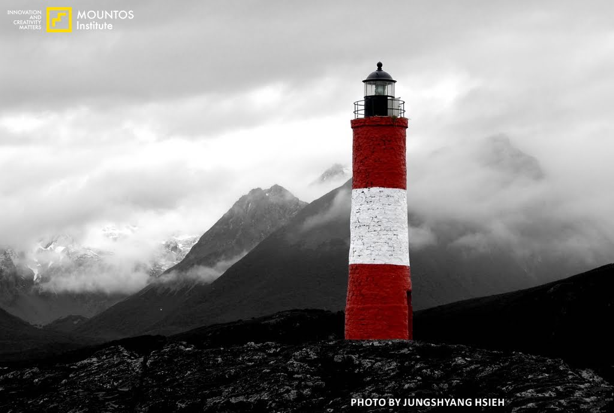
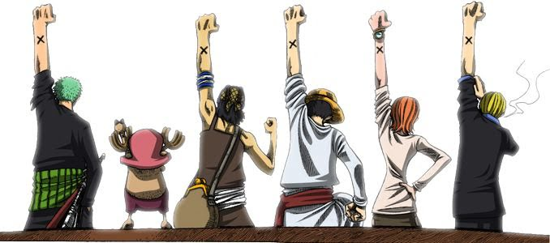

這次的故事，因起於我在網路上發現一件令人震驚的消息，原來 2012 年度的第九屆 Keep Walking 夢想資助計畫已經正式起跑，而且今天還是最後截止申請日。

倒**……….**（這是動作狀態詞，也是內心期待詞！因為我現在寫完這篇心得後只想好好癱倒在床上睡上一大覺。）

如果誰能看到我當下的臉部表情，一定會發現瞬間長得像下面這淡定臉一樣：

<!-- TODO: MISSING IMAGE  -->

淡定臉

擺在我面前只有兩個選擇，一是像前些年一樣，繼續晃悠著等待明年的下一次比賽，要不然就是連夜趕工寫完申請報名表。

大家看到這邊也應該猜到，這篇心得文章會被寫出來的原因，表示我選擇的是後者。

時間雖然緊促，但是參加報名表整份寫起來卻比想像中上手，畢竟已經在腦海中醞釀了許多年，一點也不陌生。

說起來，反倒是如何將雜亂無章的各種發想，彙整成一篇有條有理的文章，才是花了最多的時間。

寫到一半時，我的腦海突兀地冒出一個想法，寫作的人其實與油漆師傅非常相像，都是由各式各樣的材料中，選出適合的一部分，然後由點而線而面的架構出一件完美作品。

關於我的主題以及寫了什麼內容，先不在這邊揭露，等到之後審查如果有一個好結果再來說吧。

不過我想特別在這邊談談申請表格中的一個大標題：「團隊介紹」。

在團隊介紹這個大標題中，我寫的是「無」，也就是 ZERO，一個都沒有，至少在目前為止是這樣。

其實關於這題的內容，我是想把這個位置留給一位好朋友謝宗翔（暱稱小翔）。

小翔是我的固定旅行咖，也是與我從學生時代以來最有默契的老朋友，無論是前一晚突然互相約去開車環島或是爬玉山，還是逛街瞎扯淡一整個下午。

如果說每場探險都是一次西洋棋對弈，他就是在棋盤上充當雙腳帶領每一次的行動，我則負起佈局全盤之責，並充當眼睛觀察整個盤勢。

我們的默契就是瞭解自己必須各司其職，而且共同都有著不攻頂也無所謂的心態，我們最在意的其實只有當下。

我計畫每次的探險行動，但是僅將目標的達成排在安全考量（過度的謹慎）之後，而他則是將我不斷往目標推進，但是也尊重我在行動過程中所下達的重要決策。

而且最棒的是，他知道我何時只是在講冷笑話。

譬如說，在沒有查資料臨時約去爬一條登山古道，我才從登山口剛走十分鐘就直囔著要回家之類（他通常也會一起喊累，但是我們接著就會走完全程）。

底下這張照片中的燈塔，是小翔去過地球上的最遠邊境之地。然後當時的我正好在紐西蘭，與他隔了半個地球遙遙相望，還能上 MSN 互聊當地風情，最有默契的旅行夥伴莫過於此了吧。

<!-- TODO: MISSING IMAGE  -->

阿根廷燈塔（攝影／謝宗翔）

不過小翔離開我們這個世界的地方，倒也相當符合他的風格，中華民國的極境之地：「東沙群島」。

如果他還活在世上的話，我在報名 Keep Walking 的團隊介紹上一定是寫上他的名字，而且無論他是否有意願，我都會拉著他一起去。

但是不用想也知道，他 200% 一定會走在我的前面（被我推的，就像被我推入一個滿佈蜘蛛網的山路一樣）。

所以對於現在而言，我還是寧可在這一題寫上「無」這個答案，因為，小翔不在了。

總覺得只要這樣做，過去那些一起做傻事，一起探險，一起挨餓受凍，一起大聲歡笑的快樂時光，又可以在腦海中一次一次地浮現出來。

我想，這就是夥伴吧。

航海王：夥伴的印記