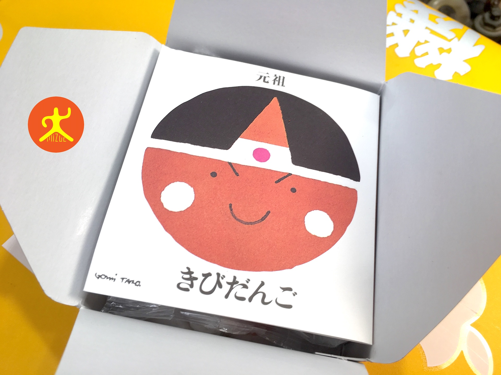

日本的岡山（Okayama）位於本州島的中部，鄰近瀨戶內海，氣溫即使在冬天也算是比較溫和的地方，是近來中華民國各家航空公司積極拓點的城市。

這是我第二次前往日本旅行時從岡山入境，不過卻是第一次從岡山回國，因此在挑選伴手禮時稍微多花了一些時間。

這次要和大家介紹的是我在機場購買的伴手禮，由岡山、倉敷地區的和菓子傳統老店「[廣榮堂](http://www.koeido.co.jp/)」所製作的桃太郎「吉備糰子（きびだんご，Ganso Kibidango）」。

可愛的外包裝無論送晚輩、平輩還是長輩都相當適宜，而且即使在機場的售價也屬於平價，不會給收禮者帶來負擔，是非常好的伴手禮選項。

*日本岡山伴手禮「菓子」包裝盒*

為了服務外國遊客，包裝盒側邊除了有整體設計感的可愛圖形外，還用英文書寫點心的詳細資料。

*日本岡山伴手禮「菓子」包裝盒側面（Okayama Japanese Sweet Rice Cake Ganso Kibidango 2）*

賞味期限其實沒有很長，像我是12月03日在機場購買，賞味期只到12月15日，這跟他們號稱全部採用天然原料，沒有其他化學添加物也有關係。

從這邊可以看出商品名稱就叫做「菓子」。不過我還是得抱怨一下，日本機場有一堆商品都是叫這個名字，但是內容物卻可能天差地遠，就不能精準點嗎？（翻桌）

*日本岡山伴手禮「菓子」成份說明（Okayama Japanese Sweet Rice Cake Ganso Kibidango 3）*

打開外包裝，印入眼簾的是可愛超大桃太郎頭像，裡頭還有店長寫給顧客的話與一些商家介紹（不過我看不懂就是了，丟）。

*日本岡山伴手禮「菓子」開箱桃太郎（Okayama Japanese Sweet Rice Cake Ganso Kibidango 4）*

一小盒裡面有十粒丸子。

*日本岡山伴手禮「菓子」10 顆包裝（Okayama Japanese Sweet Rice Cake Ganso Kibidango 5）*

*每一顆菓子都有不同的外包裝設計（Okayama Japanese Sweet Rice Cake Ganso Kibidango 8）*

每一顆丸子的外包紙袋都印有不同造型的可愛圖形（不過內容物都是一樣的）。

吉備丸子的包裝紙袋採用日本和紙，外面印有廣榮堂本店的印章，相當富有日本設計的典雅精神。

*每一個標籤都印有「廣榮堂本店」字樣（Okayama Japanese Sweet Rice Cake Ganso Kibidango 6）*

丸子的外觀如下面這張照片，其實吃起來的口感有點花蓮麻糬，也有點像涼糕。

對於愛吃甜食的人來說可能會不夠甜，但是我覺得這種清香的甜度其實相當適合，即使是長輩也不會覺得太膩。

*日本岡山伴手禮「菓子」實體*

整體而言，廣榮堂」元祖桃太郎吉備糰子（きびだんご）的包裝精巧，外型設計也相當可愛。雖然味道不是太強烈，但也代表適合大多數人。

我認為吉備糰子是從日本岡山、倉敷地區回國的旅客可以帶上幾份分送親友的輕巧伴手禮物。