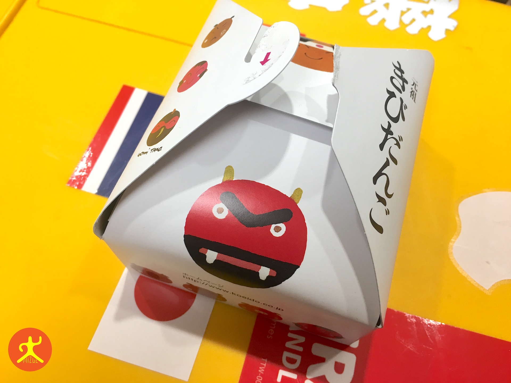
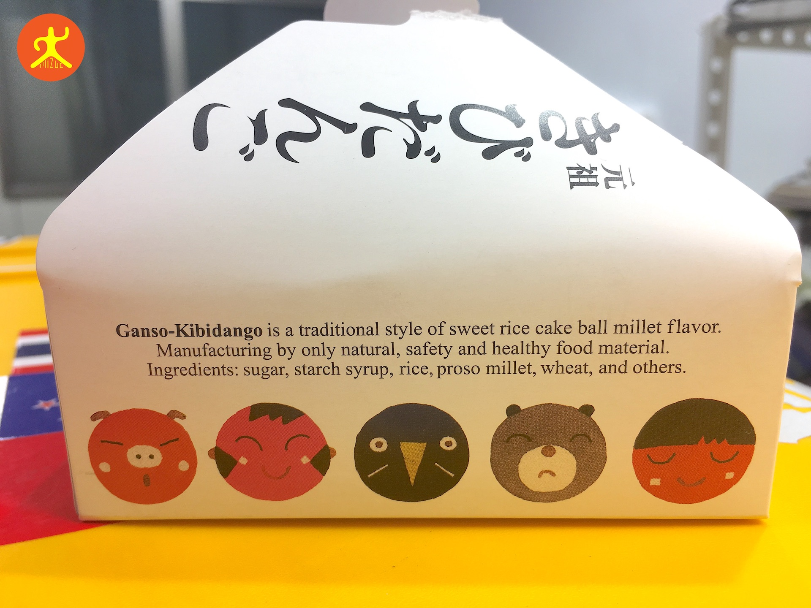
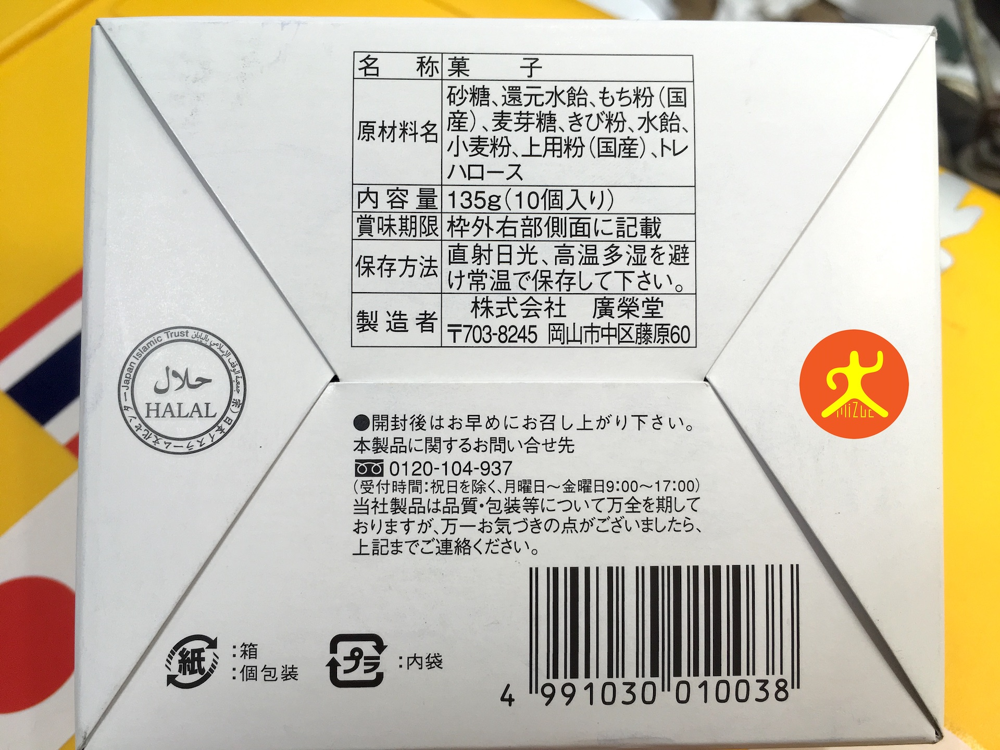
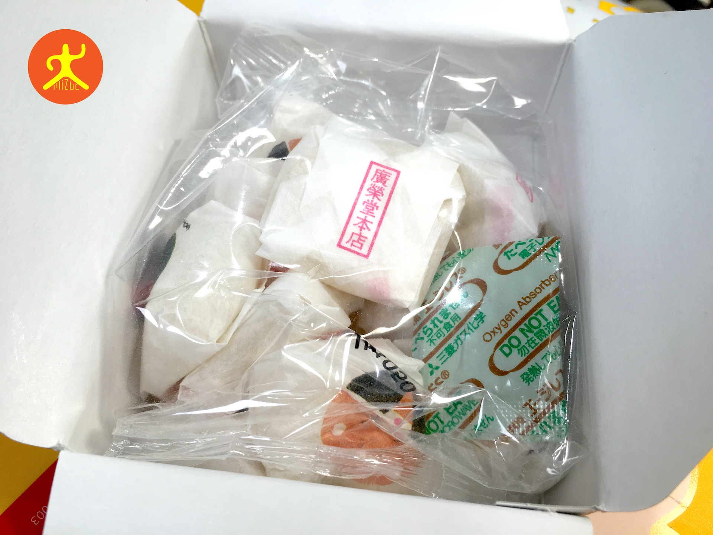
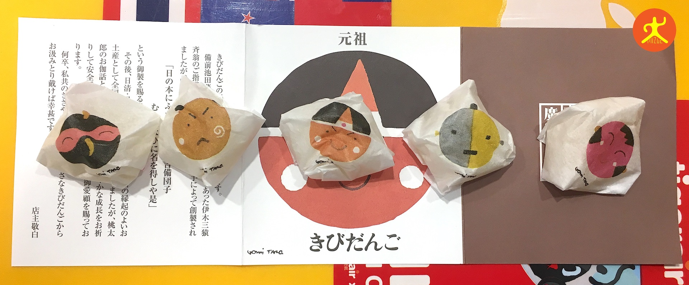
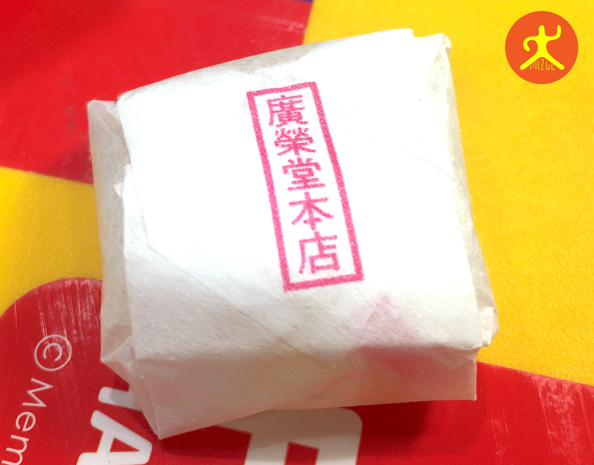
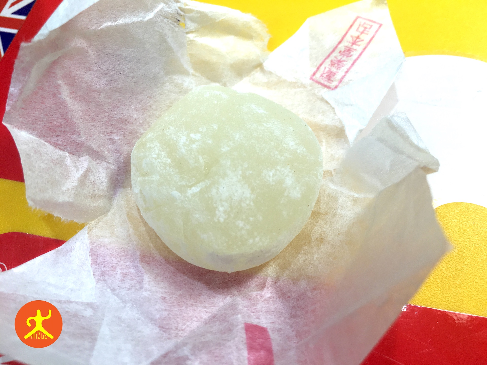

日本的岡山（Okayama）位於本州島中部，鄰近瀨戶內海。即使在冬天，氣候也相對溫和，是近年來中華民國各家航空公司積極拓點的城市。

這是我第二次前往日本旅行。在回國選購伴手禮時，我挑選了這款由岡山、倉敷地區的和菓子傳統老店「[廣榮堂](http://www.koeido.co.jp/)」所製作的桃太郎「**吉備糰子**」（きびだんご，Ganso Kibidango）。可愛的包裝與平實的售價，無論送予長輩或平輩都相當體面。

*日本岡山伴手禮「菓子」包裝盒*

為了服務外國遊客，包裝側邊除了有充滿設計感的可愛插圖，還詳細標註了英文說明。

*日本岡山伴手禮「菓子」包裝盒側面*

## 天然原料與賞味期限

由於產品號稱全部採用天然原料，不含化學添加物，因此賞味期限並不長（約兩週左右）。購買時需多加注意。

*日本岡山伴手禮「菓子」成份說明*

## 開箱體驗

打開外包裝，迎接你的是充滿童趣的超大桃太郎頭像。裡頭還附有店家的介紹與感謝卡。

*日本岡山伴手禮「菓子」開箱桃太郎*

我們購買的小盒裝內含十粒丸子。有趣的是，每一顆丸子的外包裝紙袋都印有不同造型的可愛人物插圖。

*日本岡山伴手禮「菓子」10 顆包裝*

*每一顆菓子都有不同的外包裝設計*

吉備丸子的包裝採用日本和紙，外層印有「廣榮堂本店」的印鑑。在細微處流露出日本傳統工藝的典雅。

*每一個標籤都印有「廣榮堂本店」字樣*

## 口感與評語

丸子實體看起來晶瑩剔透，吃起來的口感介於臺灣的花蓮麻糬與涼糕之間。清香的甜度恰到好處，不愛甜食的人或長輩也能輕易接受，是非常適合分送親友的輕負擔好禮。

*日本岡山伴手禮「菓子」實體*

整體而言，廣榮堂的吉備糰子不僅包裝精巧、外型吸睛，且風味老少咸宜，是我推薦造訪岡山與倉敷地區時的首選禮品。