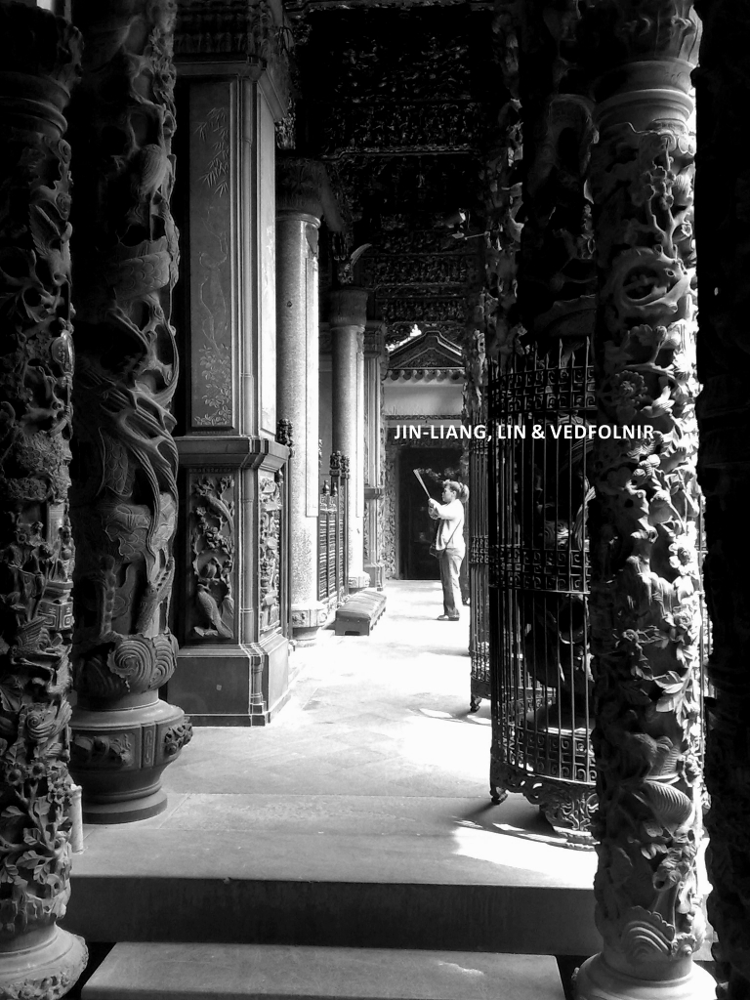
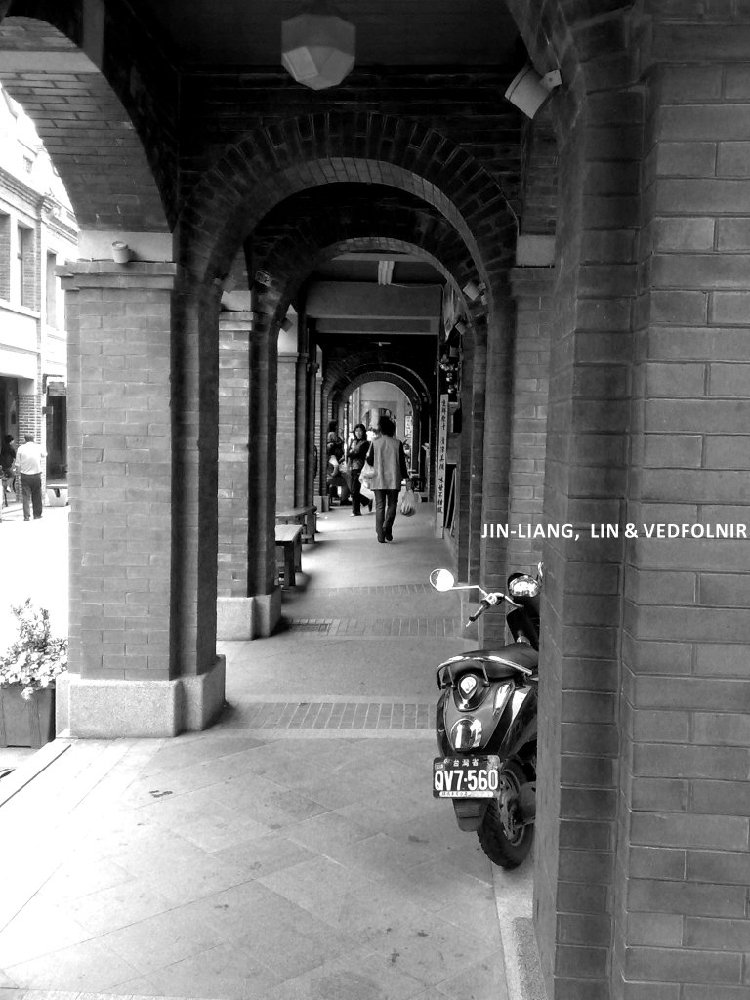

**藍染**（Blue Dye / Indigo），是一種在全球古文明中都曾熠熠生輝的顏色。

打從知道大屯山頂曾遍布早期漢人種植的「大青（馬藍）」後，我便幻想著親手製造染料。直到這次與盈慧的三峽之行，我才領悟到這抹深藍背後，有著多麼厚重且破碎的程序。

## 警察的「超遠」地圖與迷路奇緣

我們原本只是打算在三峽老街閒逛。詢問藍染教室的過程中，派出所的員警們七嘴八舌地告訴我們：「鎮公所在很遠很遠的山上，開車快開出三峽界了。」

沒想到一走出派出所向右轉，那棟聳立在眼前的龐然大物，赫然印著四個大字：**三峽鎮公所**。

> [!NOTE]
> **人生教訓**：人民的保姆確實熱情，但關於「距離」的空間感，還是親自看一眼地圖比較靠譜。

## 藍染的藝術課：採及、腐化、打藍

在鎮公所對門的一間隱蔽教室裡，我們偷偷溜進一群國小四年級生的課堂，聽著講師分享藍染的四部曲。真正要製作純粹的染料，得歷經採集、腐化、打藍到建藍，那股如「皮蛋」般的特殊氣息，確實考驗著旅人的耐心。

### 三峽祖師廟與老街隨影

*三峽祖師廟的虔誠香火*

*巴洛克式的紅磚老街風景*

## 結語：藝術價值的重新界定

我們各買了一塊棉布，在染缸前學著小學生反覆浸染、擰乾。我的作品被盈慧笑稱帶著一股「科學家的匠氣」。

在等待染色的過程中，一名國小生對著自己的作品喃喃自語：「這幅圖看起來好奇怪。」吸引了我們的目光。那是一幅充滿前衛風格、甚至帶著狂氣的印染。那一刻，我看著盈慧，心中浮起同一個問題：**到底藝術的價值是由誰來定義的呢？**

或許是在這場迷路與深藍交織的實驗中，我們都找到了一種屬於業餘者的自由。