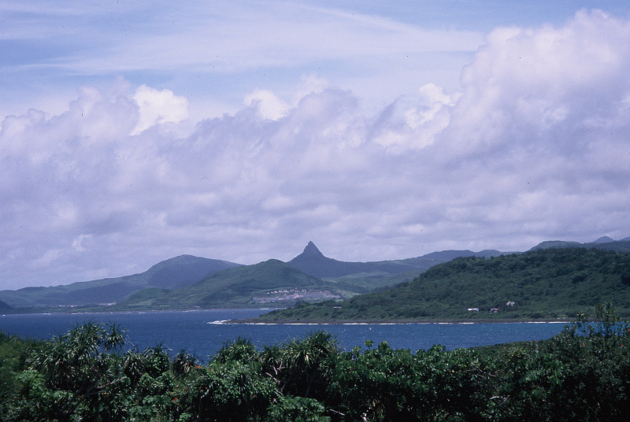
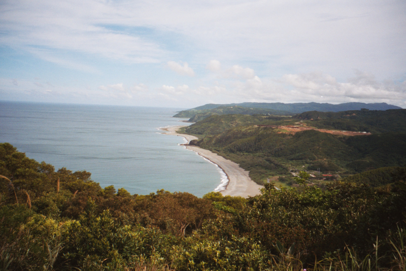

在青澀的學生時代，老師口中那段「通過憲兵查核身分」才能進入的 **旭海大草原** 🇹🇼，曾是我心中對成人冒險世界的終極想像。

如今，這片位於屏東牡丹鄉、俯瞰太平洋的壯麗草原，雖已部分轉型為觀光園區，但其背負的軍事色彩與原始之美依然令人神往。

## 歷史的座標：東、西草原之謎

真正的「旭海中正大草原」原本位於海拔 300 公尺處。民國 64 年，因 **中山科學研究院** 選址於此佈建著名的「九鵬基地」，國防重心隨之移入。

因為長期穩定的軍事管制，當地人轉而在東北方開發了另一區草原，即現在遊客主要造訪的「旭海親親大草原」。

*從高處遠眺，屏東墾丁的大尖山在雲霧中若隱若現*

## 驚險的吉普車登山回憶

回想起第一次環島拜訪旭海，當時聯絡道路極其簡陋。我與兩名陌生女孩拼車，搭乘當地著名的吉普車。在那段連步行都顯得吃力的崎嶇陡坡上，引擎的嘶吼與懸崖邊的視野，構成了一段畢生難忘的刺激旅程。

當車子最終停在山頂，迎接我們的是那抹從翠綠延伸至深藍太平洋的無邊際海景。

*綠意、藍天與海風的完美共奏*

## 旭海草原遊樂區資訊

| 月份 | 開放狀態 | 入園時段 |
| :--- | :--- | :--- |
| **1-2月、7-8月** | 每日開放 | 09:00 - 17:00 |
| **其他月份** | 週一、五、六、日及國定假日 | 09:00 - 17:00 |

### 清潔規費
*   **小型車**（含重機）：50 元
*   **機車**：20 元
*   **大型車**：100 元

> [!IMPORTANT]
> **生態保護守則**：
> 1. 請務必留在步道內行走，切勿採集植物或驚擾野生動物。
> 2. 園區內**全面禁止露營、野炊**，請於 17:00 前撤離。
> 3. 留意步道濕滑與季節性的蜜蜂、蛇類出沒。

旭海，是一處適合慢下來與風對話的地點。如果你也嚮往那抹未經雕飾的藍，這裡絕對值得列入你的環島必訪單中。