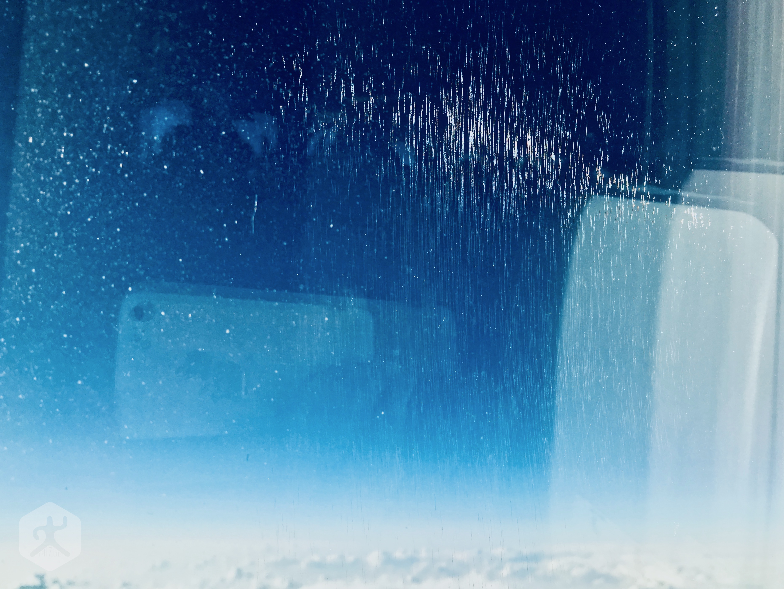

原本早在半年前就計畫前往日本大阪，卻因故臨時取消。隨即在一週內重新購買了酷航（Scoot）前往北海道札幌新千歲機場的機票。這是我第一次搭乘酷航，也是一場「再忙也要去旅行」的隨興出走。

## 在桃園機場第一航廈登機

酷航的櫃檯位於**桃園國際機場第一航廈**。與許多廉航不同，酷航櫃檯通常位於後排位置。這次因為機場捷運搭錯慢車，趕到櫃檯時已接近關櫃時間，差點就得改去臺灣環島了。

幸運的是，在滿頭大汗中終於趕上了。酷航在桃園機場用的登機閘門離通道較近，省去了不少奔波。

> [!WARNING]
> 航班登機閘門請以電子機票與現場看板為準，廉航閘口偶爾會臨時更換。

## 酷航 B787 機艙觀察

酷航目前標榜全 **B787** 夢幻客機機隊（採用勞斯萊斯發動機）。這款飛機的載客量比常見的 A320 多出將近一倍，內部採用了 3-3-3 的座椅配置，第一眼感覺相當「擁擠」。

*酷航 B787 航班的機艙座位*

由於座位數多，走道空間顯得較為狹窄，且空服員查驗機票的 SOP 非常嚴謹。整體搭乘感與台灣虎航或樂桃航空（Peach）差異不大，最大的不同在於乘客密度較高。

*飛過日本四國高空的 Scoot 酷航航班*

## 飛往北海道新千歲機場

從桃園機場（原中正機場 🇹🇼）起飛後，航程約三個半小時。這是我搭乘低成本航空航程最長的一次。

雖然 B787 被譽為夢幻客機，但對於經濟艙乘客而言，長時間飛行仍挑戰屁股的耐受力。不過 B787 確實有一個有趣的新玩具：**液晶遮陽窗戶**。

*酷航 787 航班的可調光窗戶*

這種窗戶沒有遮陽板，而是透過控制鈕改變玻璃變色程度。它具備偏光濾鏡效果，讓人在飽覽窗外美景的同時，又不會被刺眼的陽光照射，也不用擔心開窗影響鄰座休息。

---

## 旅遊資訊

* **官方網站**：[Scoot 酷航](https://www.flyscoot.com/zhtw)
* **目的地**：日本北海道新千歲機場（CTS）