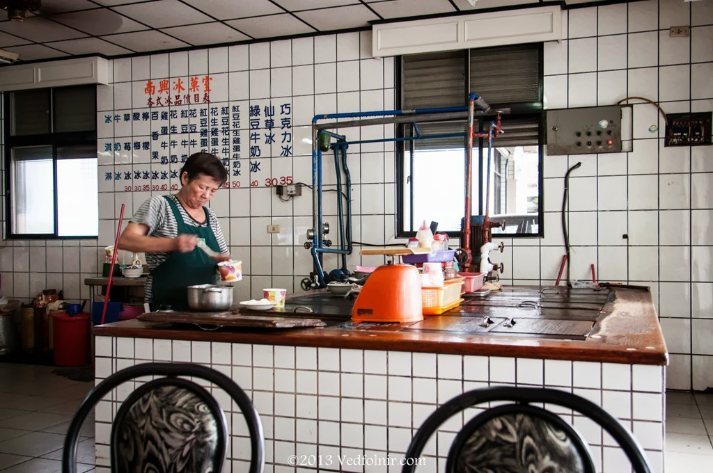
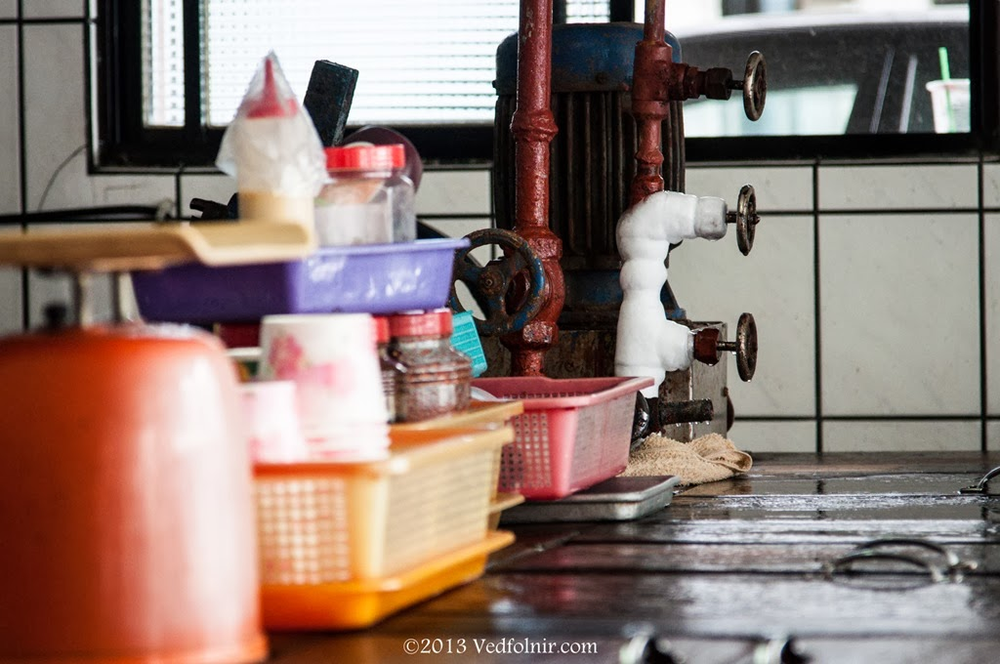
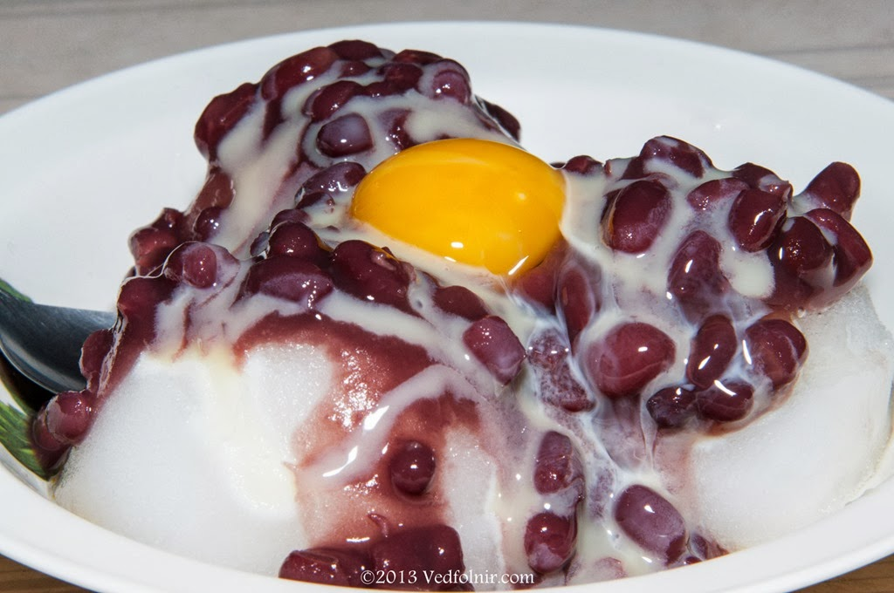

在 **宜蘭 🇹🇼** 的末端，有個與山極近、卻也與海緊貼的小鎮：**南澳**。

這裡的省道兩側矗立著兩間傳奇冰店——「建華冰店」與「南興冰菓室」。它們不僅是旅人的補給站，更是一種對門競爭、卻又共生共榮的神祕存在。

## 南興與建華：順路的選擇

每一次開車南下花蓮，這兩間店是我的必經之處。
論風格，建華的裝潢與點綴多了幾分觀光感，而 **南興冰菓室** 則保留了更多古樸的歲月痕跡。

*南興冰菓室那充滿時光感的內部陳設*

## 紅豆牛奶冰加雞蛋的化學作用

來到這，唯一的選擇就是招牌的「**紅豆牛奶冰加生雞蛋**」。

> [!IMPORTANT]
> **美味瞬間**：當你將那顆金黃的生蛋黃拌入細緻的棉棉冰中，蛋黃會因為低溫而瞬間呈現出一種奇妙的半凝固狀態。與濃郁的煉乳、綿密的紅豆交織在一起，那種鹹甜適中、滑順濃郁的口感，是南澳獨有的味覺符號。

*每一份配料都承載著小鎮的樸實與熱情*

*在冰堆中緩慢凝結的蛋黃，是這道清涼美食的靈魂*

## 迷走客的交通忠告

如果你是搭火車來南澳一探「神秘沙灘」，請千萬別學我試圖徒步走回車站。在那段幾乎要把人曬乾的漫長道路後，南興冰菓室成了拯救我的最後一根稻草。

強烈建議在 **南澳火車站 🇹🇼** 門口先叫好計程車，省下的體力，才能讓你更有餘裕多吃一碗冰。相關經驗請參考：[《南澳車站到神秘沙灘的計程車攻略》](https://mizuc.com/call-a-taxi-from-nanao-station-to-mysterious-beach/)。